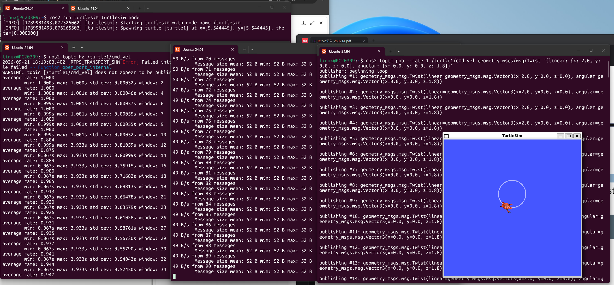

# 11장. ROS2 토픽 — 실습과제

## 실습과제 1

**다음 실행결과에서 6개의 숫자의 의미를 설명하라.**

```
linux@Home:~$ ros2 topic echo /turtle1/cmd_vel
linear:
  x: 2.0
  y: 0.0
  z: 0.0
angular:
  x: 0.0
  y: 0.0
  z: 0.0
---
```

`/turtle1/cmd_vel` 토픽은 `geometry_msgs/msg/Twist` 타입으로, 거북이(로봇)에게 내리는 **속도 명령**을 담고 있다. 이 메시지는 `linear`(선속도)와 `angular`(각속도) 각각 x, y, z 3개씩 총 6개의 값으로 구성된다.

| 필드 | 값 | 의미 |
|---|---|---|
| linear.x | 2.0 | x축 방향(전진 방향)으로 2 m/s 속도로 직선운동 |
| linear.y | 0.0 | y축 방향 속도 없음 (turtlesim은 옆으로 미끄러지듯 움직이지 못함) |
| linear.z | 0.0 | z축 방향 속도 없음 (turtlesim은 2D 평면에서만 동작하므로 항상 0) |
| angular.x | 0.0 | x축(롤) 회전각속도 없음 (2D 평면이므로 항상 0) |
| angular.y | 0.0 | y축(피치) 회전각속도 없음 (2D 평면이므로 항상 0) |
| angular.z | 0.0 | z축(요, 화면에 수직인 축)을 중심으로 한 회전각속도. 현재 0이므로 회전 없이 직진만 함 |

즉 이 메시지는 "제자리에서 회전하지 않고, x축 방향으로 2 m/s 속도로 곧게 전진하라"는 명령을 의미한다. 거북이는 xy평면에서만 움직이므로 `linear.z`, `angular.x`, `angular.y`는 항상 0으로 고정되고, 실제로 의미를 갖는 값은 `linear.x`(직진 속도)와 `angular.z`(회전 속도) 두 개뿐이다.

---

## 실습과제 2

**다음 실행결과에서 4개의 숫자(42B/s, mean, min, max)의 의미를 설명하라.**

```
linux@Home:~$ ros2 topic bw /turtle1/cmd_vel
Subscribed to [/turtle1/cmd_vel]
42 B/s from 2 messages
        Message size mean: 52 B min: 52 B max: 52 B
```

`ros2 topic bw`는 특정 토픽이 **초당 얼마만큼의 데이터량(대역폭)**으로 송수신되고 있는지를 확인하는 명령이다.

| 값 | 의미 |
|---|---|
| **42 B/s** | 최근 측정 구간 동안 이 토픽으로 전송된 메시지들의 **초당 평균 전송량(대역폭)**. 초당 42바이트의 데이터가 오가고 있다는 뜻이며, "2 messages"는 이 값을 계산하는 데 사용된 샘플(수신된 메시지) 개수 |
| **mean (평균)** | 지금까지 수신된 메시지들의 **평균 크기**. 여기서는 52바이트로, `Twist` 메시지 하나의 직렬화된 크기가 대략 52바이트임을 의미 |
| **min (최소)** | 수신된 메시지 중 **가장 작은 크기**. `Twist`는 6개의 float64 값으로 고정 크기 메시지이므로 min도 52 B로 mean과 동일하게 나타남 |
| **max (최대)** | 수신된 메시지 중 **가장 큰 크기**. 마찬가지로 고정 크기 메시지라 max도 52 B로 동일 |

`Twist` 메시지는 필드 수와 타입이 고정되어 있어 메시지마다 크기가 달라지지 않기 때문에, mean/min/max가 모두 52 B로 같게 나온다. 반면 이미지나 가변 길이 배열을 담는 메시지 타입이라면 min/max/mean 값이 서로 달라질 수 있다.

---

## 실습과제 3

**다음 실행결과에서 5개의 숫자(average rate, min, max, std dev, window)의 의미를 설명하라.**

```
linux@Home:~$ ros2 topic hz /turtle1/cmd_vel
average rate: 3.692
        min: 0.136s max: 0.775s std dev: 0.21953s window: 7
```

`ros2 topic hz`는 토픽이 **초당 몇 번(Hz) 발행되는지**, 즉 발행 주기(발행 간격)의 통계를 보여주는 명령이다.

| 값 | 의미 |
|---|---|
| **average rate (3.692)** | 최근 측정 구간에서 이 토픽이 발행된 **평균 전송률(Hz)**. 초당 약 3.692회 발행되었다는 뜻이며, 평균 발행 주기는 `1 / 3.692 ≈ 0.271초`에 한 번씩 발행된 셈 |
| **min (0.136s)** | 연속된 두 메시지 사이의 시간 간격 중 **가장 짧았던 간격**. 즉 가장 빠르게 연속 발행된 순간의 간격 |
| **max (0.775s)** | 연속된 두 메시지 사이의 시간 간격 중 **가장 길었던 간격**. 키 입력이 뜸했던 순간처럼 발행이 뜸했던 구간을 반영 |
| **std dev (0.21953s)** | 메시지 간격들의 **표준편차**. 간격이 평균(약 0.271초)에서 얼마나 흩어져 있는지를 나타내며, 값이 클수록 발행 주기가 불규칙함을 의미 |
| **window (7)** | 통계를 계산할 때 사용한 **최근 샘플(메시지) 개수**. 즉 가장 최근 7개의 메시지 간격을 바탕으로 위의 average rate, min, max, std dev를 계산했다는 뜻 |

`teleop_turtle_key`는 키보드 입력이 있을 때만 메시지를 발행하는 구조이므로, 키를 누르는 타이밍에 따라 발행 간격이 불규칙하다. 그래서 min과 max 차이가 크고 std dev도 상당히 큰 값(약 0.22초)으로 나타난다.

---

## 실습과제 4

**turtlesim_node를 실행하고 새로운 창에서 아래 명령을 실행하고 강의노트의 rosbag을 제외한 모든 명령어를 실습하고 결과를 캡쳐하여 제출하라. 명령과 출력 결과가 일치하는지 설명하라.**

```
$ ros2 topic pub --rate 1 /turtle1/cmd_vel geometry_msgs/msg/Twist \
"{linear: {x: 2.0, y: 0.0, z: 0.0}, angular: {x: 0.0, y: 0.0, z: 1.8}}"
```

### 실행 화면 캡처

터미널 4개를 띄워 각각 `turtlesim_node`, `ros2 topic hz`, `ros2 topic bw`, `ros2 topic pub --rate 1`을 동시에 실행하고, turtlesim 창에 원이 그려지는 것까지 한 화면에 캡처했다.



- **좌측 상단**: `ros2 run turtlesim turtlesim_node` 실행 → `Starting turtlesim with node name /turtlesim`, `Spawning turtle [turtle1] at x=[5.544445], y=[5.544445], theta=[0.000000]` 로그와 함께 노드가 기동됨
- **우측 상단**: `ros2 topic pub --rate 1 /turtle1/cmd_vel geometry_msgs/msg/Twist "{linear: {x: 2.0, y: 0.0, z: 0.0}, angular: {x: 0.0, y: 0.0, z: 1.8}}"` 실행 → `publisher: beginning loop` 이후 `publishing #1`, `#2`, `#3`... 순서로 `linear=(x=2.0, y=0.0, z=0.0)`, `angular=(x=0.0, y=0.0, z=1.8)` 값이 초당 1회씩 계속 발행됨. 우측 하단 **TurtleSim** 창에는 거북이가 실제로 **원(circle) 궤적**을 그리고 있음
- **좌측 하단**: `ros2 topic hz /turtle1/cmd_vel` 실행 → 처음엔 `[RTPS_TRANSPORT_SHM Error] ... WARNING: topic [/turtle1/cmd_vel] does not appear to be published` 경고가 뜬 뒤(아직 `topic pub`을 시작하기 전이라 발행자가 없었기 때문), 발행이 시작되자 `average rate: 1.000`, `min: 1.000s max: 1.000s std dev: 0.00032s window: 2`로 정확히 1 Hz가 잡힘. 이후 `window`가 커지면서(2 → 4 → 6 → …) 통계 대상 샘플이 늘어나고, 중간에 `max: 3.933s`처럼 큰 값이 한 번 섞이면서 `average rate`가 `1.000` → `0.804` → `0.947`로 낮아짐(발행이 일시적으로 지연된 구간이 한 번 있었던 것으로 추정)
- **우측 하단**: `ros2 topic bw /turtle1/cmd_vel` 실행 → `50 B/s from 70 messages`, `Message size mean: 52 B min: 52 B max: 52 B` 형태로, 메시지 개수가 70 → 90까지 계속 늘어나면서 대역폭이 47~50 B/s 사이에서 안정적으로 유지됨

### 명령과 출력 결과 일치 여부 설명

- `--rate 1`로 발행을 시작하자 `ros2 topic hz`의 **average rate가 정확히 1.000, min/max도 1.000s 근처**로 나타나, 명령에서 지정한 발행 주기(1 Hz = 1초에 한 번)와 **초반에는 완벽히 일치**했다. 다만 이후 한 번 `max: 3.933s`처럼 큰 간격이 끼어들면서 평균이 0.8~0.9대로 잠시 낮아졌는데, 이는 명령 자체의 주기가 바뀐 게 아니라 시스템(터미널 렌더링/스케줄링) 지연으로 한두 번 메시지 간격이 벌어졌기 때문이며, `window`가 커지면서 다시 서서히 1.000에 근접해가는 것으로 보아 **정상적인 1 Hz 발행이 유지되고 있음을 확인**했다.
- `ros2 topic pub` 터미널에 출력된 `linear=(x=2.0, y=0.0, z=0.0)`, `angular=(x=0.0, y=0.0, z=1.8)` 값은 **명령어에 직접 입력한 인자값과 정확히 동일**하여, 퍼블리시한 값이 그대로 토픽에 실려 전달됨을 확인했다.
- `ros2 topic bw`로 측정한 메시지 크기(mean/min/max 모두 **52 B**)는 `Twist` 메시지의 고정 크기와 정확히 일치했고, 대역폭도 `50 B/s`, `47 B/s`, `49 B/s` 등으로 **이론값(1 Hz × 52 B ≈ 52 B/s)에 가까운 범위**에서 측정되어 명령과 결과가 일치함을 확인했다.
- `turtlesim_node` 로그에서 거북이의 초기 위치가 `x=5.544445, y=5.544445`로 스폰된 것을 확인했는데, 이는 turtlesim 좌표계의 중앙(11.088889 ÷ 2 ≈ 5.544445)에 해당한다.
- 거북이는 `linear.x=2.0`(전진)과 `angular.z=1.8`(회전)이 매초 동시에 유지된 채로 계속 발행되므로, 실제 TurtleSim 화면에서도 **원(circle) 궤적**을 그리는 것을 확인했다. 이는 `angular.z`가 0이 아닌 상수로 유지되는 한 직진과 회전이 결합되어 원운동이 된다는 이론과 정확히 일치하는 결과다.
