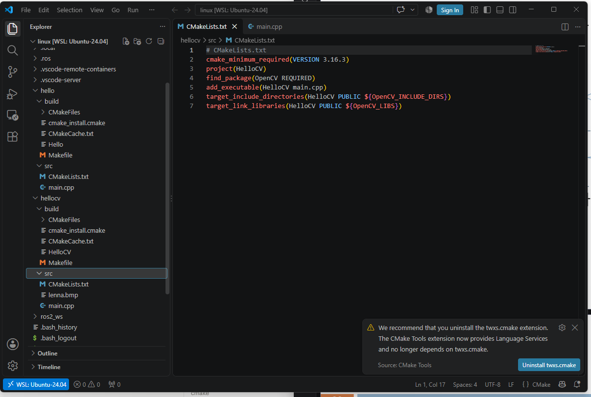
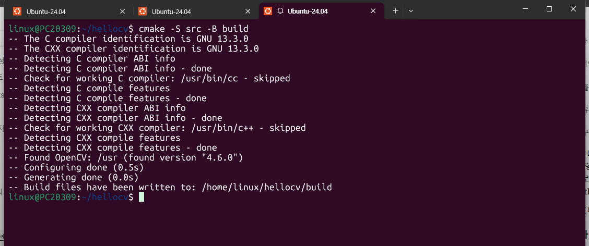
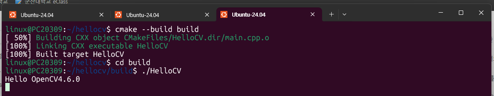
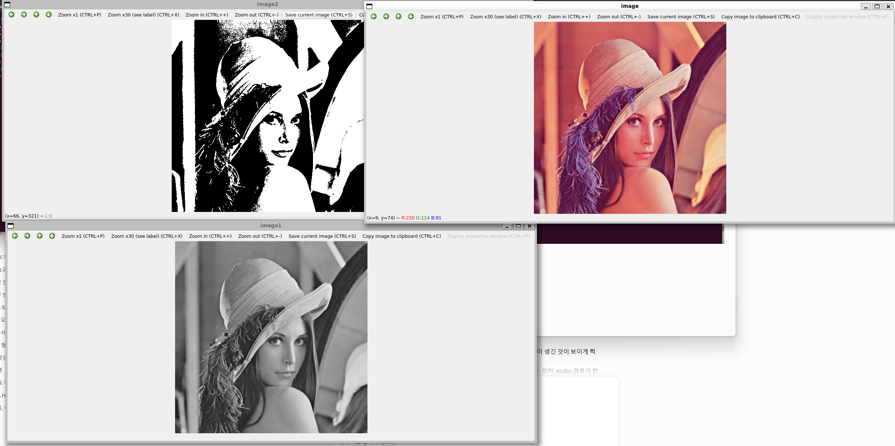

# 11장. CMake 사용법 1 — 실습과제

## 실습과제 1 — CMake를 이용하여 레나 영상을 그레이 영상, 이진 영상으로 변환하여 출력

예제 1(OpenCV 프로그램)의 `hellocv` 프로젝트를 그대로 사용하고, 프로그램(`main.cpp`)에서 레나 영상을 그레이 영상과 이진 영상으로 변환해 출력하도록 확장했다. `CMakeLists.txt`는 예제와 동일하다.

### 1. 프로젝트 구조



- `hellocv/src/` 안에 `CMakeLists.txt`, `main.cpp`, `lenna.bmp`가 있다. `src`가 **소스 트리**(CMakeLists.txt와 소스파일이 있는 경로)이다.
- `hellocv/build/`는 CMake가 생성하는 파일을 저장하는 **빌드 트리**이며, `cmake` 명령 실행 시 자동으로 만들어진다. (캡처 시점에는 이미 빌드까지 마친 뒤라 `CMakeFiles`, `CMakeCache.txt`, `Makefile`, 실행파일 `HelloCV`가 들어 있다.)
- 이렇게 소스 트리와 빌드 트리를 분리하면 소스 폴더가 지저분해지지 않고, `build` 폴더만 지우면 깨끗한 상태로 되돌릴 수 있다.

### 2. CMakeLists.txt 설명 (라인 단위)

`CMakeLists.txt`는 CMake 언어로 작성하는 프로젝트 설정 파일로, GNU Make의 `Makefile`에 해당하지만 훨씬 작성이 쉽다. 이 프로젝트에서는 한 줄에 명령 하나씩 총 7줄이 쓰였다.

| 줄 | 명령 | 설명 |
|---|---|---|
| 1 | `# CMakeLists.txt` | `#`로 시작하는 한 줄 주석이다. |
| 2 | `cmake_minimum_required(VERSION 3.16.3)` | 필요한 CMake 최소 버전을 3.16.3으로 지정한다. 실행하는 CMake가 이보다 낮으면 실행이 중단된다. 반드시 파일 첫 명령으로 호출한다. |
| 3 | `project(HelloCV)` | 프로젝트 이름을 `HelloCV`로 정한다. 언어를 따로 쓰지 않았으므로 기본값인 C, C++가 설정된다. |
| 4 | `find_package(OpenCV REQUIRED)` | 시스템에서 OpenCV 패키지를 자동으로 검색한다. 찾으면 헤더 경로(`OpenCV_INCLUDE_DIRS`), 라이브러리 목록(`OpenCV_LIBS`) 같은 정보를 변수에 저장한다. `REQUIRED`는 못 찾으면 실행을 중단하라는 뜻이다. |
| 5 | `add_executable(HelloCV main.cpp)` | `main.cpp`로부터 만들어지는 실행파일 `HelloCV`를 프로젝트의 타깃으로 추가한다. |
| 6 | `target_include_directories(HelloCV PUBLIC ${OpenCV_INCLUDE_DIRS})` | `HelloCV`를 빌드할 때 사용할 헤더 파일 경로를 지정한다. gcc의 `-I` 옵션에 해당하며, 경로는 4번 줄에서 얻은 변수를 `${변수명}`으로 참조한다. |
| 7 | `target_link_libraries(HelloCV PUBLIC ${OpenCV_LIBS})` | `HelloCV`에 링크할 라이브러리를 지정한다. gcc의 `-l` 옵션에 해당한다. |

즉 2~3번 줄은 프로젝트 기본 정보, 4번 줄은 외부 라이브러리 검색, 5~7번 줄은 실행파일과 그 빌드 옵션(헤더 경로, 링크 라이브러리) 설정이다.

### 3. Configure & Generate

```
$ cmake -S src -B build
```



- `-S src`는 소스 트리, `-B build`는 빌드 트리를 지정한다. 이 명령이 **Configure**와 **Generate** 두 단계를 수행한다.
- `The C compiler identification is GNU 13.3.0`, `The CXX compiler identification is GNU 13.3.0`: 시스템의 C/C++ 컴파일러를 자동으로 검색해 GNU 13.3.0임을 확인했다.
- `Detecting ... ABI info`, `Detecting ... compile features`: 컴파일러의 ABI와 지원 기능을 점검하는 과정이다.
- `Found OpenCV: /usr (found version "4.6.0")`: `find_package(OpenCV REQUIRED)`가 실행되어 시스템에 설치된 OpenCV 4.6.0을 찾았다.
- `Configuring done` → 수집한 정보를 `CMakeCache.txt` 등에 저장하는 Configure 단계 완료, `Generating done` → 빌드 도구용 `Makefile`을 만드는 Generate 단계 완료.
- 마지막 줄은 생성된 파일이 `/home/linux/hellocv/build`에 저장되었음을 알려 준다.

### 4. Build & 실행

```
$ cmake --build build
$ cd build
$ ./HelloCV
```



- `cmake --build build`는 Generate 단계에서 만들어진 `Makefile`을 이용해 실제 빌드 도구를 호출하는 **Build** 단계이다.
- `[ 50%] Building CXX object CMakeFiles/HelloCV.dir/main.cpp.o`: `main.cpp`를 컴파일해 오브젝트 파일을 만들었다.
- `[100%] Linking CXX executable HelloCV`: 오브젝트 파일에 OpenCV 라이브러리를 링크해 실행파일 `HelloCV`를 만들었다.
- `build` 폴더로 이동해 `./HelloCV`를 실행하면 `Hello OpenCV4.6.0`이 출력되는데, 컴파일 시 사용한 OpenCV 버전(4.6.0)이 `find_package`로 찾은 버전과 일치함을 확인할 수 있다.
- 영상 경로를 `../src/lenna.bmp`처럼 `build` 폴더 기준 상대경로로 지정했기 때문에, 실행은 반드시 `build` 폴더 안에서 해야 한다.

### 5. 실행 결과



프로그램을 실행하면 창 3개가 동시에 열린다.

| 창 이름 | 내용 | 설명 |
|---|---|---|
| `image` | 원본 컬러 영상 | `lenna.bmp`를 읽어 그대로 출력한 컬러 영상이다. 창 아래쪽에 마우스 위치의 R, G, B 값이 표시된다. |
| `image1` | 그레이 영상 | 컬러 영상을 밝기 정보만 남긴 흑백(그레이스케일) 영상으로 변환한 결과로, 한 픽셀이 0~255의 밝기 하나로 표현된다. |
| `image2` | 이진 영상 | 그레이 영상을 임계값 기준으로 나누어 각 픽셀을 0(검정) 또는 255(흰색) 둘 중 하나로 만든 결과이다. 중간 밝기 없이 흑백으로만 표현되어 윤곽이 뚜렷하게 보인다. |

세 창을 비교하면 컬러(3채널) → 그레이(1채널, 256단계) → 이진(1채널, 2단계) 순으로 영상의 정보량이 줄어드는 것을 확인할 수 있다.

CMake 관점에서는 `CMakeLists.txt`의 설정을 바꾸지 않고 `main.cpp`만 수정했는데도 `cmake --build build`만 다시 실행하면 변경된 소스만 다시 컴파일되어 결과가 반영된다. 설정(CMakeLists.txt)과 소스(main.cpp)의 역할이 분리되어 있기 때문이다.
