# 12장. ROS2 서비스 — 실습과제

> ※ 아래 순서는 강의노트에 나온 순서가 아니라, 실제로 터미널에서 실행한 순서(캡처 순서) 그대로입니다. 그래서 `/spawn`이 `/kill`보다 뒤에 나오고, `service list`가 raffaello까지 포함해서 보이는 등 슬라이드상의 예시 순서와는 차이가 있습니다.

## 실습과제 1 — 모든 명령어 사용예 실습

### 1. `ros2 service list`

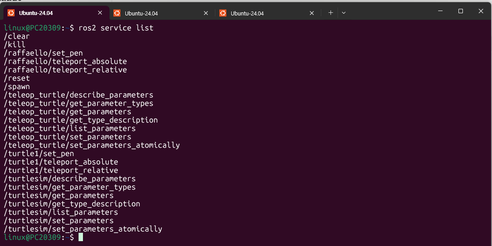

`/clear`, `/kill`, `/reset`, `/spawn`처럼 turtlesim 노드가 기본으로 제공하는 서비스뿐 아니라, `/raffaello/set_pen`, `/raffaello/teleport_absolute`, `/raffaello/teleport_relative`처럼 이미 spawn되어 있던 `raffaello` 거북이의 서비스도 함께 보인다. 즉 이 캡처 시점에는 `turtle1`과 `raffaello` 두 마리가 모두 존재하는 상태였다. `/teleop_turtle/*`, `/turtlesim/*`의 `describe_parameters`, `get_parameters`, `set_parameters` 등은 노드의 파라미터 조회/설정을 위한 서비스로, turtlesim 고유 기능이 아니라 ROS2 노드라면 공통으로 갖는 서비스다.

### 2. `ros2 service list -t`

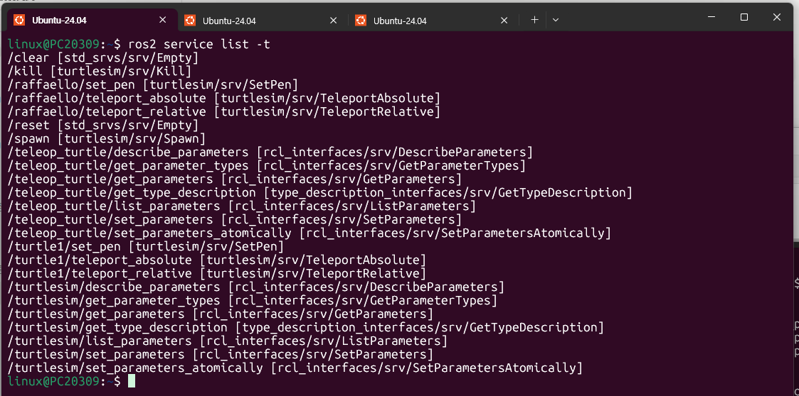

`-t` 옵션을 붙이면 서비스명 옆에 `[타입]`이 함께 출력된다. `/clear`, `/reset`은 `std_srvs/srv/Empty`, `/kill`은 `turtlesim/srv/Kill`, `/spawn`은 `turtlesim/srv/Spawn`, `set_pen`은 `turtlesim/srv/SetPen`, `teleport_absolute`/`teleport_relative`는 각각 `turtlesim/srv/TeleportAbsolute`/`TeleportRelative` 타입임을 확인할 수 있다.

### 3. `ros2 run turtlesim turtle_teleop_key`로 거북이 이동

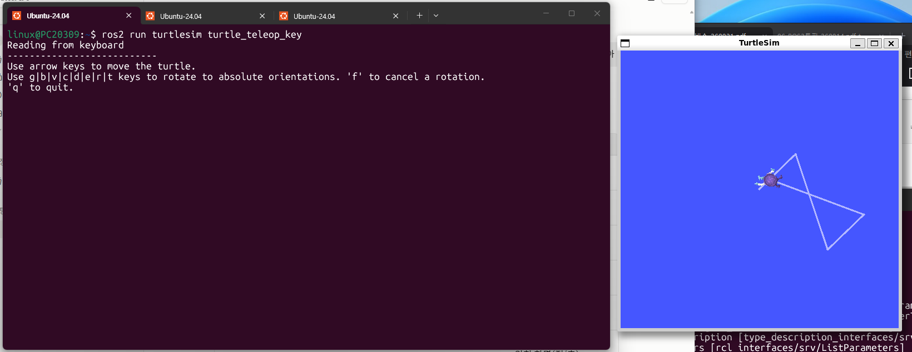

방향키로 `turtle1`을 이동시켜 삼각형 모양의 궤적을 그렸다. 뒤에서 `/clear` 서비스로 이 궤적이 지워지는 것을 비교하기 위한 사전 작업이다.

### 4. `ros2 service call /clear std_srvs/srv/Empty`

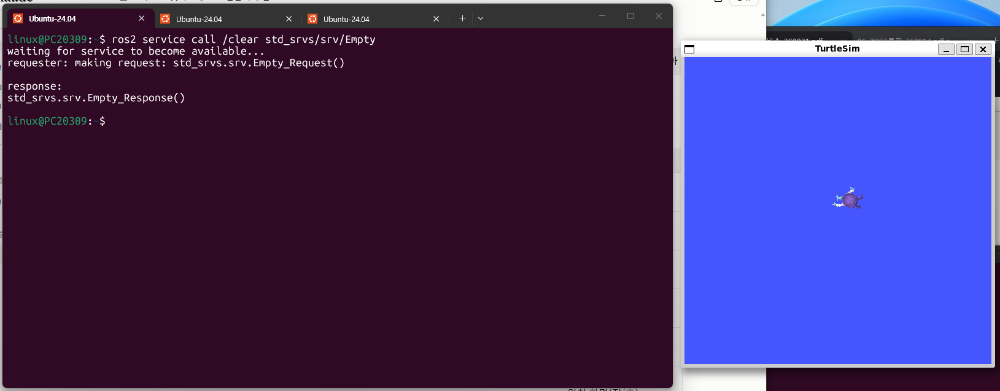

```
requester: making request: std_srvs.srv.Empty_Request()

response:
std_srvs.srv.Empty_Response()
```

`std_srvs/srv/Empty`는 요청/응답 모두 필드가 없는(비어 있는) 타입이라 `<arguments>` 없이 호출한다. 서비스 호출 직후 TurtleSim 화면에서 앞서 그렸던 삼각형 궤적이 모두 지워지고 거북이만 남은 것을 확인할 수 있다.

### 5. `ros2 service call /kill turtlesim/srv/Kill "name: 'turtle1'"`

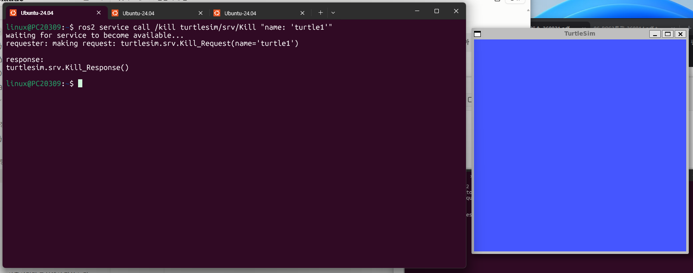

```
requester: making request: turtlesim.srv.Kill_Request(name='turtle1')

response:
turtlesim.srv.Kill_Response()
```

`name` 인자에 제거할 거북이 이름을 지정한다. 호출 후 화면에서 `turtle1`이 완전히 사라지고 빈 화면만 남는다.

### 6. `ros2 service call /spawn turtlesim/srv/Spawn "{x: 5.5, y: 7, theta: 1.57, name: 'raffaello'}"`

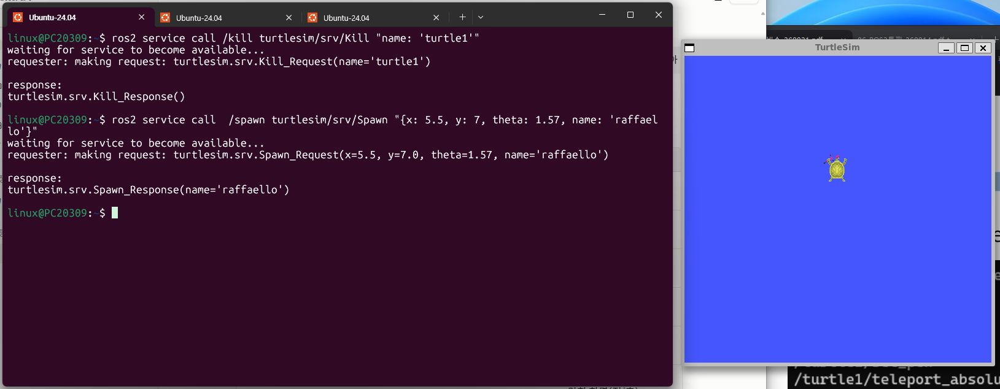

같은 터미널에서 바로 이전 `/kill` 명령 뒤에 이어서 실행했다.

```
requester: making request: turtlesim.srv.Spawn_Request(x=5.5, y=7.0, theta=1.57, name='raffaello')

response:
turtlesim.srv.Spawn_Response(name='raffaello')
```

`(x, y, theta)`로 지정한 위치·자세에 `raffaello`라는 이름의 새 거북이가 생성되었고, 응답의 `name` 필드로 실제 생성된 거북이 이름이 반환된다.

### 7. `ros2 service call /reset std_srvs/srv/Empty`

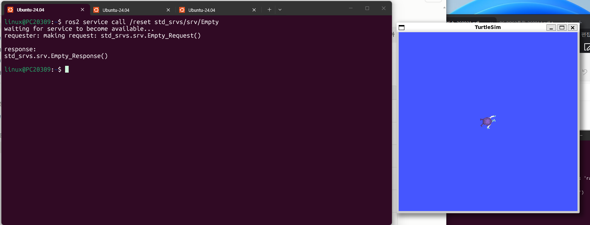

```
requester: making request: std_srvs.srv.Empty_Request()

response:
std_srvs.srv.Empty_Response()
```

`/reset`을 호출하면 시뮬레이션이 초기화되면서 기본 거북이(`turtle1`)가 화면 중앙에 새로 생성되고 궤적도 모두 사라진다.

### 8. `ros2 service call /turtle1/set_pen ...` + `ros2 topic pub --rate 10 ...`

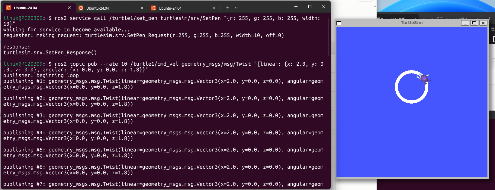

```
$ ros2 service call /turtle1/set_pen turtlesim/srv/SetPen "{r: 255, g: 255, b: 255, width: 10}"
requester: making request: turtlesim.srv.SetPen_Request(r=255, g=255, b=255, width=10, off=0)

response:
turtlesim.srv.SetPen_Response()

$ ros2 topic pub --rate 10 /turtle1/cmd_vel geometry_msgs/msg/Twist "{linear: {x: 2.0, y: 0.0, z: 0.0}, angular: {x: 0.0, y: 0.0, z: 1.8}}"
```

`set_pen`으로 펜 색을 흰색(r=255,g=255,b=255), 굵기를 10으로 바꾼 뒤, 11장에서 배운 `ros2 topic pub`으로 `linear.x=2.0`, `angular.z=1.8`인 속도 명령을 10Hz로 계속 발행해 거북이가 원을 그리도록 했다. 화면에 이전보다 두꺼운 흰색 원 궤적이 그려진 것을 확인할 수 있다 — `set_pen`으로 바꾼 색/굵기가 실제로 반영됨을 보여주는 결과다.

---

## 실습과제 2 — `/turtle1/teleport_absolute`, `/turtle1/teleport_relative` 설명 및 실습

### 서비스 설명

- **`/turtle1/teleport_absolute`** (`turtlesim/srv/TeleportAbsolute`): 거북이를 **맵의 절대좌표** `(x, y, theta)`로 순간이동시키는 서비스. 현재 위치나 방향과 무관하게 지정한 좌표로 곧바로 이동하며, 펜이 내려져 있으면 기존 위치에서 새 위치까지 **직선 궤적**이 그려진다.
- **`/turtle1/teleport_relative`** (`turtlesim/srv/TeleportRelative`): 거북이의 **현재 위치와 방향(heading)을 기준**으로 `linear`만큼 그 방향으로 전진, `angular`만큼 제자리 회전시키는 서비스. 즉 절대좌표가 아니라 "지금 있는 자리에서 얼마나 움직일지"를 상대적으로 지정한다는 점이 `teleport_absolute`와 다르다.

### 9. `ros2 service type /turtle1/teleport_absolute`

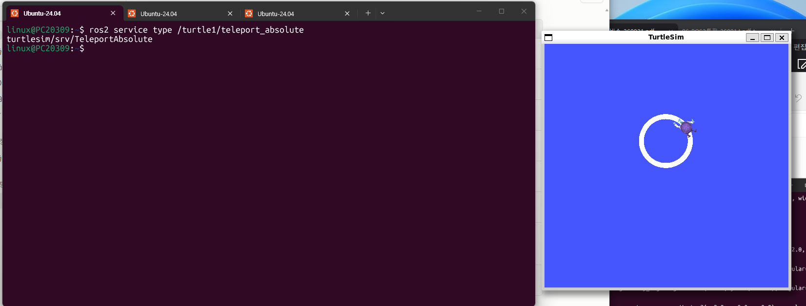

```
turtlesim/srv/TeleportAbsolute
```

이전 실습과제1의 8번(원 그리기)에서 그려둔 흰색 원 궤적이 화면에 그대로 남아 있는 상태에서 이어서 진행했다.

### 10. `ros2 service call /turtle1/teleport_absolute turtlesim/srv/TeleportAbsolute "{x: 1.0, y: 1.0, theta: 0.0}"`

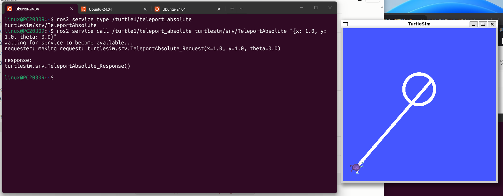

```
requester: making request: turtlesim.srv.TeleportAbsolute_Request(x=1.0, y=1.0, theta=0.0)

response:
turtlesim.srv.TeleportAbsolute_Response()
```

호출 직후 거북이가 좌표 `(1.0, 1.0)`(화면 좌측 하단 근처)로 곧바로 이동했고, 기존 위치(원 궤적이 있던 자리)부터 `(1.0, 1.0)`까지 **일직선 궤적**이 그려졌다. 이는 절대좌표로 순간이동하면서 그 사이 경로가 자동으로 그려지기 때문이다.

### 11. `ros2 service type /turtle1/teleport_relative`

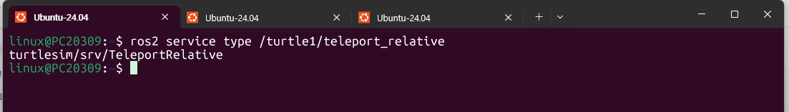

```
turtlesim/srv/TeleportRelative
```

새 터미널(히스토리 초기화)에서 타입만 먼저 확인했다.

### 12. `ros2 service call /turtle1/teleport_relative turtlesim/srv/TeleportRelative "{linear: 2.0, angular: 0.0}"`

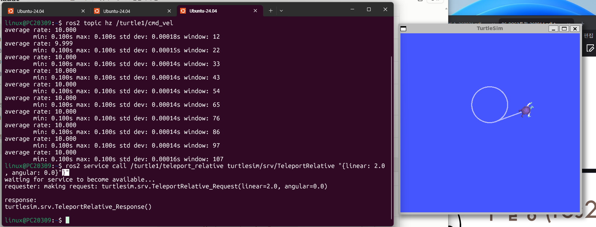

같은 터미널에 이전에 실행해두었던 `ros2 topic hz /turtle1/cmd_vel`(11장 실습 때 켜둔 것) 로그가 위쪽에 함께 남아 있는데, 이번 12장 실습과는 무관한 이전 명령 이력이다. 실제 이번 과제에 해당하는 부분은 아래 호출이다.

> **참고: 주파수(Frequency)와 주기(Period)**
>
> `ros2 topic hz`의 `average rate`는 **주파수(Hz)**, 즉 "1초에 몇 번 발행되는가"를 나타낸다. **주기(Period, 단위: 초)**는 "한 번 발행되고 다음 발행까지 걸리는 시간"으로, 둘은 서로 역수 관계다.
>
> $$\text{주기}(T) = \dfrac{1}{\text{주파수}(f)}, \qquad \text{주파수}(f) = \dfrac{1}{\text{주기}(T)}$$
>
> 위 캡처(Image 12)에서 `average rate: 10.000`, `min: 0.100s max: 0.100s`로 나온 것이 정확히 이 관계를 보여준다: 주파수가 **10 Hz**(초당 10회 발행)이므로 주기는 `1 / 10 = 0.1초`가 되어, 실제로 `min`/`max`에 찍힌 **0.100s**와 정확히 일치한다. 즉 `ros2 topic pub --rate 10`으로 10 Hz(주파수)로 발행하도록 지정했기 때문에, 메시지 사이 간격(주기)이 0.1초로 매우 일정하게 유지된 것이다.
>
> 참고로 11장에서 다뤘던 `--rate 1`(1 Hz) 예제는 주기가 `1/1 = 1초`였고, `teleop_turtle_key`처럼 키 입력이 있을 때만 발행하는 경우처럼 발행 간격(주기)이 들쭉날쭉하면 평균 주파수(average rate)와 표준편차(std dev)도 함께 커진다 — 즉 **주파수가 일정할수록 주기의 편차(std dev)가 작아지고, 주파수가 불규칙할수록 편차가 커진다.**

```
requester: making request: turtlesim.srv.TeleportRelative_Request(linear=2.0, angular=0.0)

response:
turtlesim.srv.TeleportRelative_Response()
```

`angular=0.0`이라 방향은 그대로 유지한 채, 현재 향하고 있는 방향으로 `linear=2.0`만큼 전진했다. 화면에서 거북이가 있던 자리에서 현재 heading 방향으로 곧게 이동한 궤적이 추가로 그려진 것을 확인할 수 있다.

### 실습결과 정리

| 서비스 | 좌표 기준 | 회전/이동 방식 | 결과 |
|---|---|---|---|
| `teleport_absolute` | 맵의 절대좌표 (0,0)~(11.08,11.08) | `(x, y, theta)`를 직접 지정 | 지정한 절대 위치로 순간이동, 이전 위치와 직선으로 연결됨 |
| `teleport_relative` | 거북이의 현재 위치·heading | 현재 방향 기준 `linear`만큼 전진, `angular`만큼 회전 | 현재 있던 자리에서 상대적으로 이동/회전 |

두 서비스 모두 요청 후 `response: turtlesim.srv.TeleportAbsolute_Response()` / `TeleportRelative_Response()`처럼 **빈 응답**을 반환하는데, 이는 이동이 성공했는지 여부만 확인하면 되고 별도로 돌려줄 값이 없는 서비스이기 때문이다(성공적으로 응답이 왔다는 것 자체가 이동이 완료됐다는 뜻).
