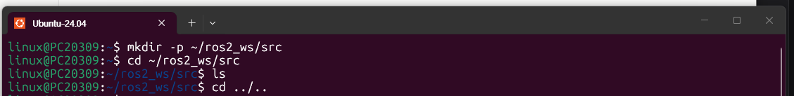
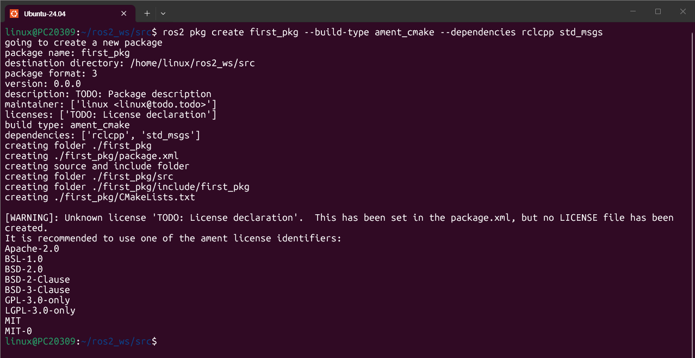
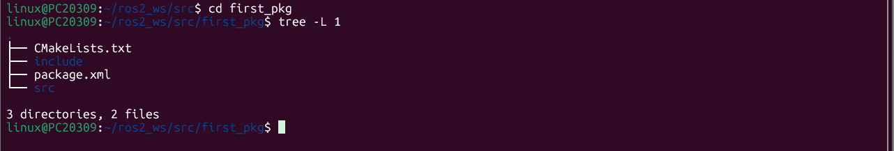
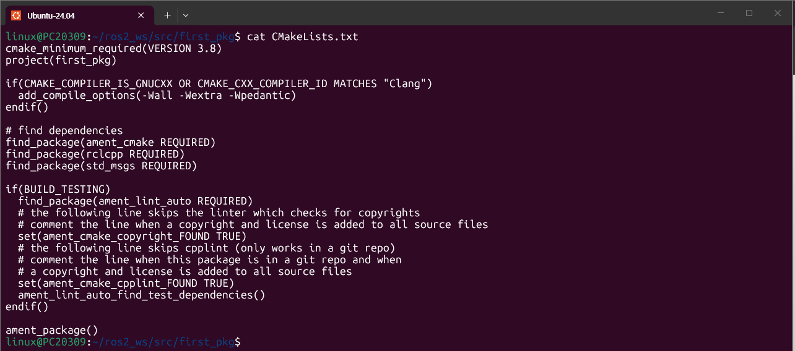
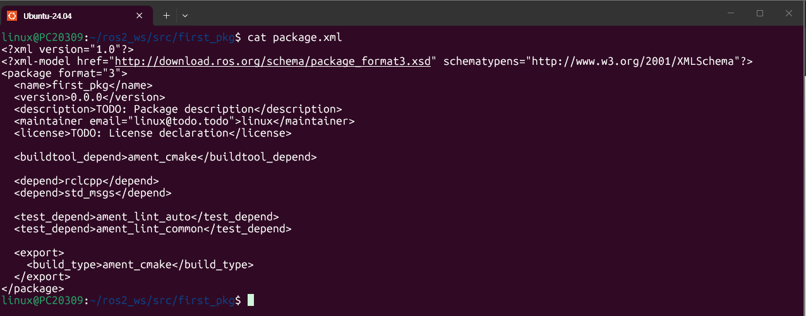
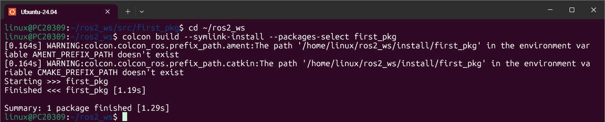
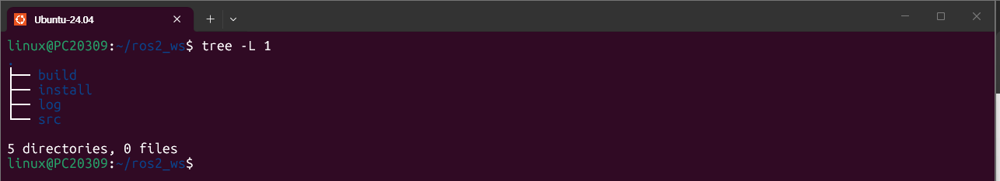

# 13장. ROS2 파일시스템과 빌드 시스템 — 실습과제

> 실습 환경: Ubuntu 24.04 (WSL2) / ROS 2 Jazzy / 작업폴더 `~/ros2_ws`

---

## 실습과제 1

### 1-1. 빌드 시스템과 빌드 툴의 차이를 설명하라.

둘의 가장 큰 차이는 **빌드 대상의 범위**이다.

| 구분 | 빌드 시스템 (build system) | 빌드 툴 (build tool) |
|---|---|---|
| 대상 | **단일 패키지** | **워크스페이스 전체 패키지** |
| 역할 | 한 패키지의 의존성을 해결하고 빌드하여 실행 파일을 생성 | 각 패키지에 기술된 종속성 그래프를 해석하고, 위상(topological) 순서대로 각 패키지에 맞는 빌드 시스템을 호출 |
| ROS 2 예시 | `ament_cmake` (C++, CMake 기반), `ament_python` (Python, setuptools 기반) | `colcon` |

ROS에서는 수많은 패키지를 함께 빌드하고, 패키지마다 사용하는 언어가 달라 서로 다른 빌드 시스템을 쓴다. 이를 통합 관리하고 의존성 순서에 맞게 빌드해 주는 것이 빌드 툴이다.

```text
            build tool (colcon)
           /         |          \
build system     build system     build system
(ament_cmake)    (ament_cmake)    (ament_python)
     |                |                |
ros2 package     ros2 package     ros2 package
   (C++)            (C++)           (Python)
```

참고로 `ament_cmake`는 ROS 1의 `catkin`을 계승한 빌드 시스템이며, ROS 1의 빌드 툴이었던 `catkin_make`, `catkin_tools` 등의 역할을 ROS 2에서는 `colcon`이 맡는다.

---

### 1-2. 패키지 생성 명령어를 실행하는 위치와 그곳으로 이동하는 명령어

- 실행 위치: **`~/ros2_ws/src`** (사용자 작업폴더 안의 `src`, 즉 사용자 패키지 소스가 저장되는 곳)
- 이동 명령어:

```bash
cd ~/ros2_ws/src
```

---

### 1-3. 패키지 생성 명령어의 사용법

```bash
ros2 pkg create <pkgname> --build-type <buildtype> --dependencies <deppkg1> ... <deppkgn>
```

| 항목 | 설명 |
|---|---|
| `<pkgname>` | 생성할 패키지 이름 |
| `--build-type <buildtype>` | 빌드 시스템 지정. C++ 패키지는 `ament_cmake`, Python 패키지는 `ament_python` |
| `--dependencies <deppkg1> ... <deppkgn>` | 패키지를 빌드하는 데 필요한 의존 패키지(라이브러리) 목록. `package.xml`과 `CMakeLists.txt`에 자동으로 반영됨 |

예) C++ 패키지 `first_pkg`를 `rclcpp`, `std_msgs`에 의존하도록 생성

```bash
cd ~/ros2_ws/src
ros2 pkg create first_pkg --build-type ament_cmake --dependencies rclcpp std_msgs
```

실행하면 `package.xml`, `CMakeLists.txt`, `src/`, `include/first_pkg/`가 자동으로 만들어진다. (패키지는 직접 폴더와 필수 파일을 만들어서 생성할 수도 있지만, 이 명령어를 쓰면 필수 파일이 자동 생성된다.)

---

### 1-4. 패키지 빌드 명령어를 실행하는 위치와 그곳으로 이동하는 명령어

- 실행 위치: **`~/ros2_ws`** (워크스페이스 최상위 폴더. `src`가 아님)
- 이동 명령어:

```bash
cd ~/ros2_ws
```

`colcon`은 워크스페이스 최상위에서 `src/` 아래의 패키지들을 찾아 빌드하고, 같은 위치에 `build/`, `install/`, `log/`를 생성하기 때문에 반드시 이 위치에서 실행해야 한다.

---

### 1-5. 패키지 빌드 명령어의 사용법

```bash
colcon build --symlink-install --packages-select <pkgname>
```

| 옵션 | 설명 |
|---|---|
| `colcon build` | 워크스페이스의 패키지를 빌드하는 colcon 명령. 옵션 없이 쓰면 `src/` 아래 **전체 패키지**를 빌드 |
| `--packages-select <pkgname>` | 지정한 **특정 패키지만 선택**하여 빌드 |
| `--symlink-install` | 설치 시 파일을 복사하는 대신 **심볼릭 링크**로 설치. 파이썬 코드, launch, 설정 파일처럼 컴파일이 필요 없는 파일은 소스를 수정하면 재빌드 없이 바로 반영됨 |

예)

```bash
cd ~/ros2_ws
colcon build --symlink-install --packages-select first_pkg
```

---

## 실습과제 2

> 사용자 홈 디렉터리 아래에 작업폴더 `ros2_ws`를 생성하고, 강의노트의 패키지 생성 및 빌드 명령어를 실습한 결과이다.

### 2-1. 작업폴더 생성

```bash
mkdir -p ~/ros2_ws/src
cd ~/ros2_ws/src
```



`-p` 옵션으로 `ros2_ws`와 그 하위 `src`를 한 번에 생성했다. 이동 후 `ls`를 실행했을 때 아무것도 출력되지 않아 `src`가 비어 있음을 확인했고, `cd ../..`로 홈 디렉터리로 돌아왔다.

---

### 2-2. 패키지 생성

```bash
cd ~/ros2_ws/src
ros2 pkg create first_pkg --build-type ament_cmake --dependencies rclcpp std_msgs
```



출력 로그에서 다음을 확인할 수 있다.

- `package format: 3`, `version: 0.0.0`: 기본 패키지 포맷 3, 초기 버전 0.0.0
- `maintainer: ['linux <linux@todo.todo>']`, `licenses: ['TODO: License declaration']`: 설명·관리자·라이선스는 모두 TODO 값으로 채워지며 직접 수정해야 함
- `build type: ament_cmake`, `dependencies: ['rclcpp', 'std_msgs']`: 지정한 빌드 타입과 의존성
- `creating ...` 줄들: `first_pkg/` 폴더, `package.xml`, `src/`, `include/first_pkg/`, `CMakeLists.txt`가 자동 생성됨
- `[WARNING]: Unknown license 'TODO: License declaration'`: 라이선스가 TODO로 설정되어 있고 LICENSE 파일도 만들어지지 않았다는 경고이다. 오류가 아니며, 배포할 때는 `Apache-2.0`, `MIT` 등 권장 식별자 중 하나로 `package.xml`의 `<license>`를 수정하면 된다.

---

### 2-3. 생성된 패키지 구조 확인

```bash
cd first_pkg
tree -L 1
```



| 이름 | 종류 | 설명 |
|---|---|---|
| `CMakeLists.txt` | 파일 | C/C++ 빌드 설정 파일. `ament_cmake`가 이 파일의 설정을 기반으로 빌드를 수행 |
| `package.xml` | 파일 | 패키지 이름, 버전, 설명, 관리자, 라이선스, 의존성 패키지 등 패키지 정보를 기술한 XML 파일 |
| `include/` | 디렉터리 | C/C++ 헤더 파일용 폴더. 안에 패키지 이름(`first_pkg`) 폴더가 만들어져 패키지별로 헤더를 구분 |
| `src/` | 디렉터리 | C/C++ 소스 코드(노드 코드)용 폴더. 현재는 비어 있음 |

> `tree`가 출력한 `3 directories, 2 files`에는 현재 폴더(`.`)가 디렉터리로 함께 집계되어, 실제 하위 디렉터리 `include`, `src` 2개 + 현재 폴더 1개 = 3으로 표시된 것이다.

---

### 2-4. CMakeLists.txt 확인

```bash
cat CMakeLists.txt
```



| 내용 | 설명 |
|---|---|
| `cmake_minimum_required(VERSION 3.8)` | 필요한 CMake 최소 버전 |
| `project(first_pkg)` | 프로젝트(패키지) 이름 |
| `if(CMAKE_COMPILER_IS_GNUCXX OR ...) add_compile_options(-Wall -Wextra -Wpedantic)` | GCC/Clang 컴파일러일 때 경고 옵션을 켬 |
| `find_package(ament_cmake REQUIRED)` | ament_cmake 빌드 시스템 사용 |
| `find_package(rclcpp REQUIRED)`, `find_package(std_msgs REQUIRED)` | 패키지 생성 시 지정한 의존성. 찾지 못하면 빌드 실패 |
| `if(BUILD_TESTING) ... endif()` | 테스트 빌드 시에만 린터(`ament_lint_auto`)를 사용. 저작권·`cpplint` 검사는 기본적으로 건너뛰도록 설정됨 |
| `ament_package()` | ament 패키지로 등록하는 필수 마지막 줄 |

> 강의자료 화면(`cmake_minimum_required 3.5`, C99/C++14 기본 설정 포함)과 달리 Jazzy 템플릿은 최소 버전이 3.8이고 표준 지정 구문이 없다. 또한 노드 소스가 아직 없으므로 `add_executable()`, `install()` 구문은 들어 있지 않으며, 노드를 추가할 때 직접 작성해야 한다.

---

### 2-5. package.xml 확인

```bash
cat package.xml
```



| 태그 | 설명 |
|---|---|
| `<package format="3">` | 패키지 포맷 버전 3 |
| `<name>first_pkg</name>` | 패키지 이름 |
| `<version>0.0.0</version>` | 패키지 버전 |
| `<description>` | 패키지 설명 (TODO 상태) |
| `<maintainer email="linux@todo.todo">linux</maintainer>` | 관리자 이름과 이메일 |
| `<license>` | 라이선스 (TODO 상태) |
| `<buildtool_depend>ament_cmake</buildtool_depend>` | 빌드에 사용하는 도구 의존성 |
| `<depend>rclcpp</depend>`, `<depend>std_msgs</depend>` | 빌드·실행 모두에 필요한 의존 패키지 |
| `<test_depend>ament_lint_auto</test_depend>`, `<test_depend>ament_lint_common</test_depend>` | 테스트 시에만 필요한 의존성 |
| `<export><build_type>ament_cmake</build_type></export>` | 이 패키지의 빌드 타입을 빌드 툴(colcon)에 알려줌 |

---

### 2-6. 패키지 빌드

```bash
cd ~/ros2_ws
colcon build --symlink-install --packages-select first_pkg
```



- `Starting >>> first_pkg` → `Finished <<< first_pkg [1.19s]`: `first_pkg` 패키지 빌드 성공
- `Summary: 1 package finished [1.29s]`: 1개 패키지 빌드 완료
- 빌드 전에 출력된 `WARNING ... AMENT_PREFIX_PATH / CMAKE_PREFIX_PATH doesn't exist` 경고는 오류가 아니다. 이전에 `ros2_ws`를 삭제하고 새로 만들었는데, 현재 터미널의 환경변수가 삭제 전 `install/first_pkg` 경로를 아직 가리키고 있어 colcon이 해당 경로를 찾지 못했다는 뜻이다. 빌드 결과에는 영향이 없으며, 새 터미널을 열어 `source /opt/ros/jazzy/setup.bash`만 실행하면 나타나지 않는다.

---

### 2-7. 빌드 후 워크스페이스 구조 확인

```bash
tree -L 1
```



빌드 후 `ros2_ws` 아래에 `build`, `install`, `log` 폴더가 새로 생성되었다 (`src`는 처음부터 존재). `5 directories`는 현재 폴더(`.`)를 포함한 개수이다.

---

### 2-8. 자동으로 생성되는 파일과 디렉터리 설명

#### (1) `ros2 pkg create`로 생성된 것 — `~/ros2_ws/src/first_pkg/`

2-3의 표 참고 (`CMakeLists.txt`, `package.xml`, `include/first_pkg/`, `src/`).

#### (2) `colcon build`로 생성된 것 — `~/ros2_ws/` 아래 3개 폴더

`tree`로 확인한 구조 (일부 생략):

```text
ros2_ws
├── build
│   ├── COLCON_IGNORE
│   └── first_pkg
│       ├── AMENT_IGNORE
│       ├── CMakeCache.txt
│       ├── CMakeFiles/
│       ├── Makefile
│       ├── cmake_install.cmake
│       ├── ament_cmake_core/
│       ├── ament_cmake_environment_hooks/
│       ├── ament_cmake_index/
│       ├── ament_cmake_symlink_install/
│       ├── colcon_build.rc
│       ├── install_manifest.txt
│       ├── symlink_install_manifest.txt
│       └── ...
├── install
│   ├── COLCON_IGNORE
│   ├── first_pkg
│   │   └── share
│   │       ├── ament_index/resource_index/...
│   │       ├── colcon-core/packages/first_pkg
│   │       └── first_pkg
│   │           ├── cmake/
│   │           ├── environment/
│   │           ├── hook/
│   │           ├── local_setup.{bash,dsv,sh,zsh}
│   │           ├── package.{bash,dsv,ps1,sh,zsh}
│   │           └── package.xml -> /home/linux/ros2_ws/src/first_pkg/package.xml
│   ├── setup.{bash,sh,zsh,ps1}
│   ├── local_setup.{bash,sh,zsh,ps1}
│   └── _local_setup_util_{sh,ps1}.py
├── log
│   ├── COLCON_IGNORE
│   ├── build_<빌드 시각>/
│   │   ├── events.log
│   │   ├── logger_all.log
│   │   └── first_pkg/ (command.log, stdout.log, stderr.log, stdout_stderr.log, streams.log)
│   ├── latest -> latest_build
│   └── latest_build -> build_<빌드 시각>
└── src
    └── first_pkg
        ├── CMakeLists.txt
        ├── include/first_pkg
        ├── package.xml
        └── src
```

**`build/` — 빌드 중간 산출물 폴더**

| 이름 | 설명 |
|---|---|
| `COLCON_IGNORE` | colcon이 이 폴더 안을 패키지 탐색 대상에서 제외하도록 하는 표시 파일 (`install/`, `log/`에도 있음) |
| `first_pkg/` | 패키지별 빌드 폴더. CMake 빌드가 이곳에서 수행됨 |
| `AMENT_IGNORE` | ament 도구가 이 폴더를 패키지 탐색에서 제외하도록 하는 표시 파일 |
| `CMakeCache.txt`, `CMakeFiles/`, `Makefile`, `cmake_install.cmake` | CMake가 생성하는 설정 캐시와 빌드·설치 스크립트 |
| `ament_cmake_core/`, `ament_cmake_environment_hooks/`, `ament_cmake_index/` | ament_cmake가 생성하는 패키지 설정(`first_pkgConfig.cmake` 등), 환경설정 스크립트(`local_setup.*`), 패키지 인덱스 파일 |
| `ament_cmake_symlink_install/`, `symlink_install_manifest.txt` | `--symlink-install` 옵션에 따라 심볼릭 링크로 설치한 파일의 목록과 스크립트 |
| `colcon_build.rc`, `colcon_command_prefix_build.sh` | colcon이 빌드 시 사용한 환경설정 |

**`install/` — 설치 결과 폴더**

| 이름 | 설명 |
|---|---|
| `first_pkg/share/first_pkg/` | 패키지가 설치되는 위치. `cmake/`(패키지 설정), `environment/`·`hook/`(환경변수 설정 스크립트), `local_setup.*`, `package.*` 포함 |
| `first_pkg/share/first_pkg/package.xml -> .../src/first_pkg/package.xml` | `--symlink-install` 때문에 복사본이 아니라 **소스의 `package.xml`을 가리키는 심볼릭 링크**로 설치됨 |
| `first_pkg/share/ament_index/...` | ROS가 설치된 패키지를 찾을 수 있게 하는 ament 인덱스 |
| `setup.bash` (`.sh`, `.zsh`, `.ps1`) | 워크스페이스 전체 환경 설정 파일. `source ~/ros2_ws/install/setup.bash`로 불러오면 이 워크스페이스의 패키지를 `ros2` 명령으로 사용할 수 있음 (기본 ROS 환경도 함께 불러옴) |
| `local_setup.*` | 이 워크스페이스의 환경만 설정하는 파일 |

현재 `first_pkg`에는 노드 소스가 없어서 실행 파일이나 라이브러리(`lib/`)는 생성되지 않았다.

**`log/` — 빌드 로그 폴더**

| 이름 | 설명 |
|---|---|
| `build_<빌드 시각>/` | 빌드를 실행할 때마다 생성되는 로그 폴더 |
| `events.log`, `logger_all.log` | 빌드 이벤트 기록과 colcon 전체 로그 |
| `first_pkg/command.log`, `stdout.log`, `stderr.log`, `stdout_stderr.log`, `streams.log` | 패키지별 실행 명령, 표준 출력, 표준 에러, 합친 출력 기록. 빌드 오류 확인에 사용 |
| `latest_build`, `latest` | 가장 최근 빌드 로그 폴더를 가리키는 심볼릭 링크 |
