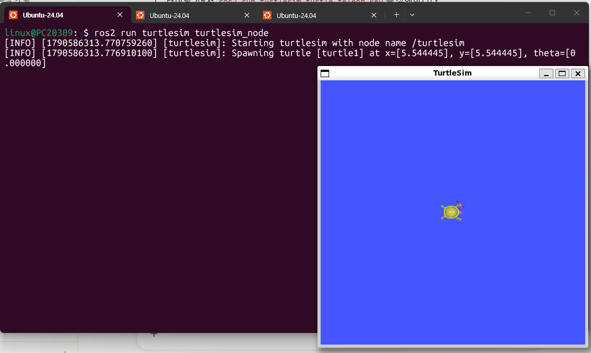
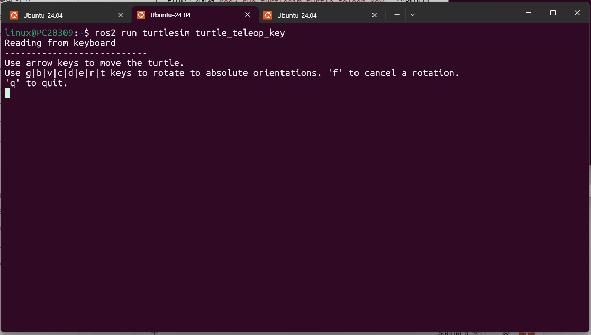
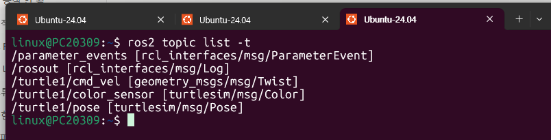
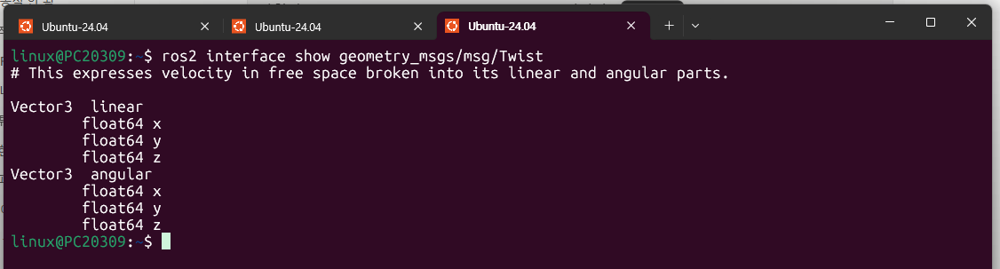
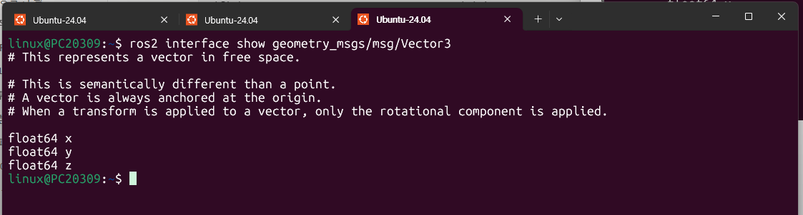
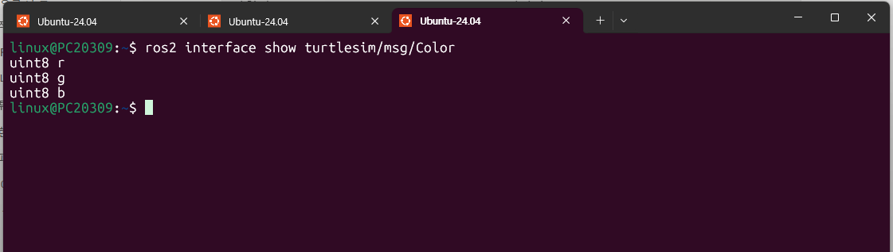
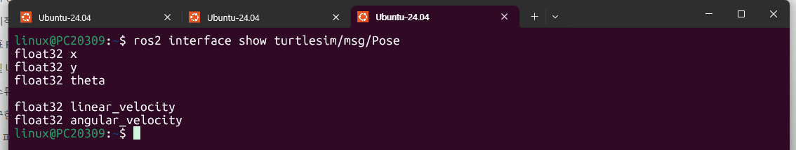
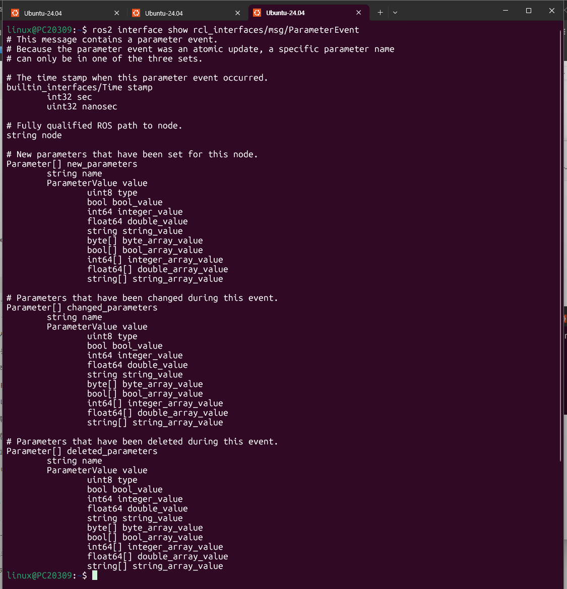
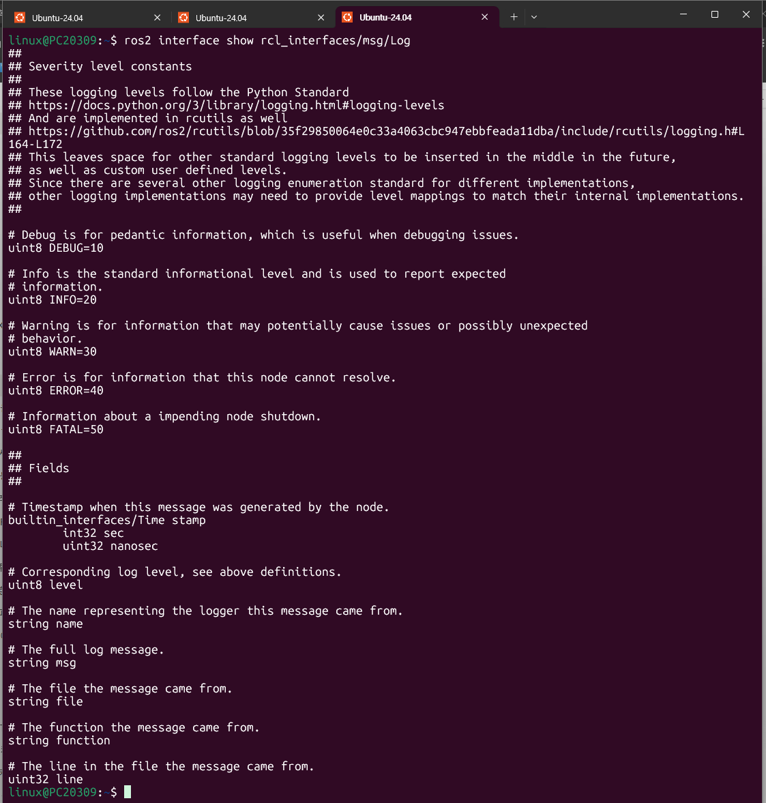

# 14장. ROS2 인터페이스 — 실습과제

## 실습과제 1

**메시지, 토픽, 서비스, 액션, 인터페이스 용어를 명확히 구분하여 설명하라.**

다섯 용어는 서로 다른 층위의 개념이다. **토픽·서비스·액션**은 노드 사이의 *통신 방식*이고, **메시지**는 그 통신에서 오가는 *데이터*이며, **인터페이스**는 그 데이터의 *자료형을 정의한 것*이다.

| 용어 | 층위 | 설명 | 정의 파일 | turtlesim 예시 |
|---|---|---|---|---|
| **인터페이스** (interface) | 자료형 정의 | 노드 사이에 주고받는 메시지의 자료형(type). msg / srv / action 세 종류가 있으며, 프로그래밍 언어와 무관하게 정의되고 빌드 과정에서 C, C++, Python 소스코드로 변환된다. | `*.msg`, `*.srv`, `*.action` (또는 IDL) | `geometry_msgs/msg/Twist` |
| **메시지** (message) | 데이터 | 통신에서 실제로 전달되는 데이터. 인터페이스(자료형)에 맞춰 채워진 값의 묶음이다. 서비스의 request/response, 액션의 goal/result/feedback도 각각 메시지 형태로 정의된다. | `*.msg` | `linear.x: 2.0` 등이 채워진 Twist 데이터 |
| **토픽** (topic) | 통신 방식 | 발행자(publisher)가 이름이 붙은 토픽으로 메시지를 보내고 구독자(subscriber)가 받는 **연속적·단방향·비동기** 통신. 1:1, 1:N, N:1, N:N 연결이 가능하고, 동작은 발행자가 트리거한다. | msg 인터페이스 사용 | `/turtle1/cmd_vel` |
| **서비스** (service) | 통신 방식 | 클라이언트가 요청(request)을 보내면 서버가 처리 후 응답(response)을 돌려주는 **일회성·양방향** 통신. 동작은 클라이언트가 트리거하고, 서버:클라이언트는 1:1이다. | `*.srv` (`---`로 request/response 구분) | `/spawn` (`turtlesim/srv/Spawn`) |
| **액션** (action) | 통신 방식 | 시간이 오래 걸리는 작업에 쓰는 **양방향** 통신. 목표(goal)를 보내면 진행 중에는 피드백(feedback)을 받고, 끝나면 결과(result)를 받는다. 토픽과 서비스가 결합된 복합 형태이다. | `*.action` (`---`로 goal/result/feedback 구분) | `/turtle1/rotate_absolute` (`turtlesim/action/RotateAbsolute`) |

### 관계 정리

- 인터페이스는 **틀(자료형)**, 메시지는 그 틀에 값을 채운 **실제 데이터**이다. 예를 들어 `geometry_msgs/msg/Twist`는 인터페이스이고, 거북이에게 전달되는 `linear.x=2.0, angular.z=1.8`은 메시지이다.
- 토픽은 메시지가 흐르는 **이름 붙은 통로**이다. 같은 `Twist` 인터페이스를 쓰더라도 토픽 이름이 다르면 서로 다른 통로이다.
- 서비스 인터페이스는 request용 메시지와 response용 메시지 한 쌍으로 이루어져 있어 메시지 인터페이스의 확장형이고, 액션 인터페이스는 goal·result·feedback 세 메시지로 이루어져 메시지·서비스 인터페이스의 확장형이다.

### 세 가지 통신 방식 비교

| 구분 | 토픽 | 서비스 | 액션 |
|---|---|---|---|
| 연속성 | 연속성 | 일회성 | 복합 (토픽 + 서비스) |
| 방향성 | 단방향 | 양방향 | 양방향 |
| 노드 역할 | 발행자 / 구독자 | 서버 / 클라이언트 | 서버 / 클라이언트 |
| 인터페이스 | msg | srv | action |
| 확인 명령어 | `ros2 topic` | `ros2 service` | `ros2 action` |
| 사용 예 | 센서 데이터, 로봇 상태, 속도 명령 | LED 제어, IK/FK 계산 | 목적지로 이동, 물건 파지 |

---

## 실습과제 2

**ros2 명령어를 이용하여 turtlesim과 teleop_turtle 노드를 각각 실행하고 현재 실행중인 토픽 메시지와 메시지 인터페이스를 출력하시오.**

### 실습 절차

1. 터미널 1에서 turtlesim 노드 실행

   ```
   $ ros2 run turtlesim turtlesim_node
   ```

   

2. 터미널 2에서 teleop_turtle 노드 실행

   ```
   $ ros2 run turtlesim turtle_teleop_key
   ```

   

3. 터미널 3에서 토픽 목록과 메시지 인터페이스를 함께 출력

   ```
   $ ros2 topic list -t
   ```

   

### 출력 결과 설명

`ros2 topic list -t`는 각 줄에 **토픽 이름**과 대괄호 안의 **메시지 인터페이스**를 함께 보여준다.

| 토픽 이름 | 메시지 인터페이스 | 설명 |
|---|---|---|
| `/parameter_events` | `rcl_interfaces/msg/ParameterEvent` | 노드의 파라미터 변경 이벤트 |
| `/rosout` | `rcl_interfaces/msg/Log` | 노드가 출력하는 로그 메시지 |
| `/turtle1/cmd_vel` | `geometry_msgs/msg/Twist` | 거북이 속도 명령 (teleop_turtle → turtlesim) |
| `/turtle1/color_sensor` | `turtlesim/msg/Color` | 거북이 아래 바닥의 색상 값 |
| `/turtle1/pose` | `turtlesim/msg/Pose` | 거북이의 위치와 자세 |

`/turtle1/cmd_vel`의 발행자는 `teleop_turtle` 노드이고 구독자는 `turtlesim` 노드이다. 방향키를 누르면 `teleop_turtle`이 `Twist` 메시지를 발행하고, `turtlesim`이 이를 구독하여 거북이를 움직인다.

---

## 실습과제 3

**앞에서 출력한 메시지 인터페이스의 정의를 ros2 명령어를 이용하여 각각 출력하시오.**

`ros2 interface show <인터페이스명>` 명령으로 실습과제 2에서 확인한 인터페이스의 정의를 출력한다.

### 3-1. geometry_msgs/msg/Twist

```
$ ros2 interface show geometry_msgs/msg/Twist
```



`Vector3` 형태의 `linear`(선속도)와 `angular`(각속도) 두 필드로 구성된다. 즉 메시지 안에 다른 메시지가 포함된 구조로, C언어의 구조체에 대응한다.

### 3-2. geometry_msgs/msg/Vector3

```
$ ros2 interface show geometry_msgs/msg/Vector3
```



`float64` 자료형의 `x`, `y`, `z` 세 필드로 이루어진 3차원 벡터이다. `Twist`는 이 `Vector3`를 두 개 품고 있으므로 결국 `float64` 6개(`linear.x/y/z`, `angular.x/y/z`)로 구성된다.

### 3-3. turtlesim/msg/Color

```
$ ros2 interface show turtlesim/msg/Color
```



`uint8` 자료형의 `r`, `g`, `b` 세 필드로 구성된다. `uint8`은 부호 없는 8비트 정수이므로 각 값은 0~255 범위이고, 빨강·초록·파랑의 세기를 나타낸다. `/turtle1/color_sensor` 토픽이 이 인터페이스를 사용하여 거북이 아래 바닥의 색을 전달한다.

### 3-4. turtlesim/msg/Pose

```
$ ros2 interface show turtlesim/msg/Pose
```



`float32` 자료형의 `x`, `y`, `theta`, `linear_velocity`, `angular_velocity` 다섯 필드로 구성된다. `x`, `y`는 거북이의 위치, `theta`는 바라보는 방향(자세), `linear_velocity`와 `angular_velocity`는 현재 선속도와 각속도를 뜻한다. `/turtle1/pose` 토픽이 이 인터페이스를 사용하여 거북이의 현재 상태를 계속 발행한다.

### 3-5. rcl_interfaces/msg/ParameterEvent

```
$ ros2 interface show rcl_interfaces/msg/ParameterEvent
```



노드의 파라미터가 변경될 때 그 사건을 알리는 메시지이다. 출력에서 확인되는 구조는 다음과 같다.

| 필드 | 자료형 | 의미 |
|---|---|---|
| `stamp` | `builtin_interfaces/Time` (`int32 sec`, `uint32 nanosec`) | 파라미터 이벤트가 발생한 시각 |
| `node` | `string` | 이벤트가 발생한 노드의 전체 경로 |
| `new_parameters` | `Parameter[]` | 이 노드에 새로 설정된 파라미터 |
| `changed_parameters` | `Parameter[]` | 이번 이벤트에서 값이 바뀐 파라미터 |
| `deleted_parameters` | `Parameter[]` | 이번 이벤트에서 삭제된 파라미터 |

`Parameter`는 `string name`과 `ParameterValue value`를 품고 있고, `ParameterValue`는 값의 종류를 나타내는 `uint8 type`과 `bool`, `int64`, `float64`, `string`, 각 배열형 값 필드들로 이루어져 있다. 즉 메시지 안에 메시지가 있고, 그 안에 다시 메시지 배열이 들어가는 **중첩 구조**이며, C언어로 비유하면 구조체 안의 구조체 배열에 해당한다.

### 3-6. rcl_interfaces/msg/Log

```
$ ros2 interface show rcl_interfaces/msg/Log
```



노드가 남기는 로그를 전달하는 메시지로, **로그 수준 상수**와 **필드**로 나뉜다.

| 상수 | 값 | 의미 |
|---|---|---|
| `DEBUG` | 10 | 디버깅할 때 유용한 세부 정보 |
| `INFO` | 20 | 예상된 정보를 알리는 표준 수준 |
| `WARN` | 30 | 문제를 일으키거나 예상치 못한 동작으로 이어질 수 있는 정보 |
| `ERROR` | 40 | 노드가 스스로 해결할 수 없는 문제 |
| `FATAL` | 50 | 노드가 곧 종료됨을 알리는 정보 |

| 필드 | 자료형 | 의미 |
|---|---|---|
| `stamp` | `builtin_interfaces/Time` | 노드가 메시지를 생성한 시각 |
| `level` | `uint8` | 위 상수 중 하나의 로그 수준 |
| `name` | `string` | 로그를 남긴 로거의 이름 |
| `msg` | `string` | 로그 메시지 전체 내용 |
| `file` | `string` | 메시지가 나온 파일 |
| `function` | `string` | 메시지가 나온 함수 |
| `line` | `uint32` | 메시지가 나온 파일 내 줄 번호 |

실습과제 2의 화면에서 `turtlesim` 노드가 출력한 `[INFO] ... Spawning turtle [turtle1] ...` 로그가 `level`이 `INFO`(20)인 `Log` 메시지의 한 예이며, 이런 메시지가 `/rosout` 토픽으로 발행된다.
