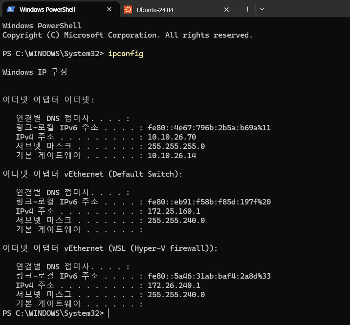
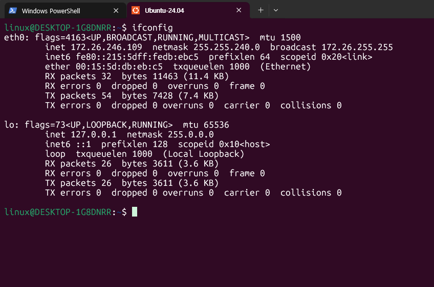
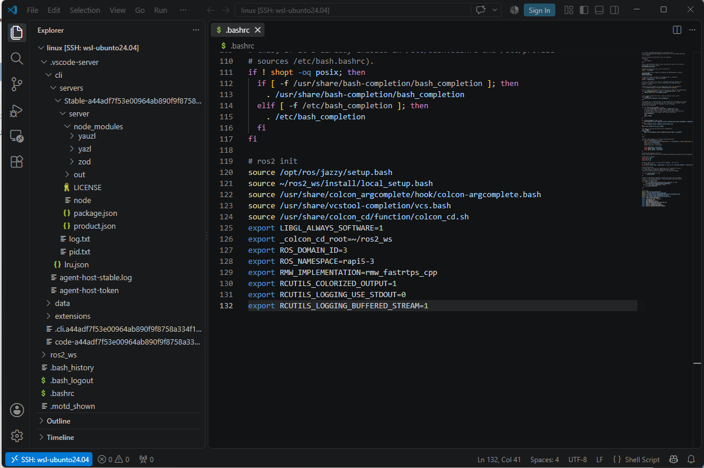
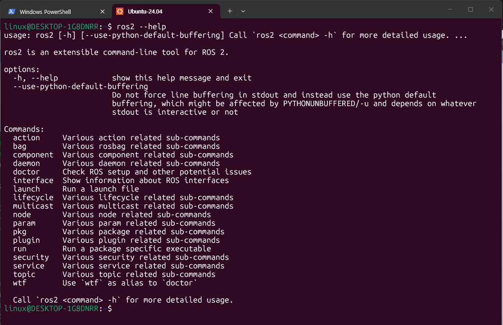
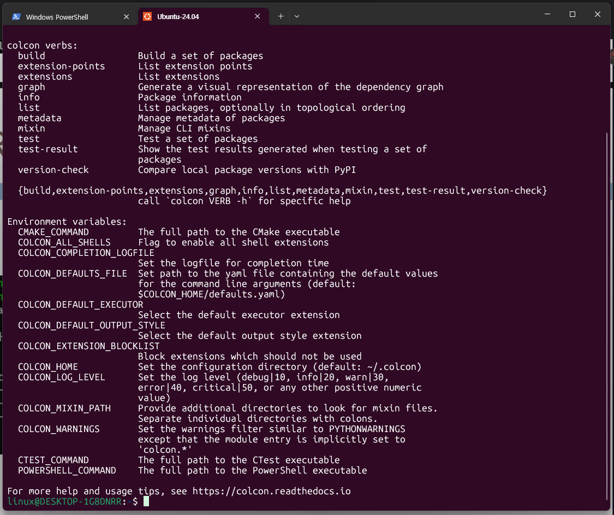
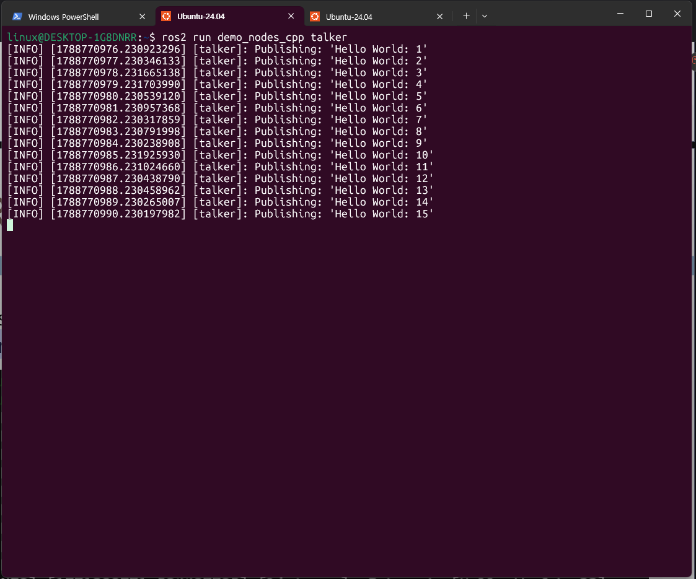
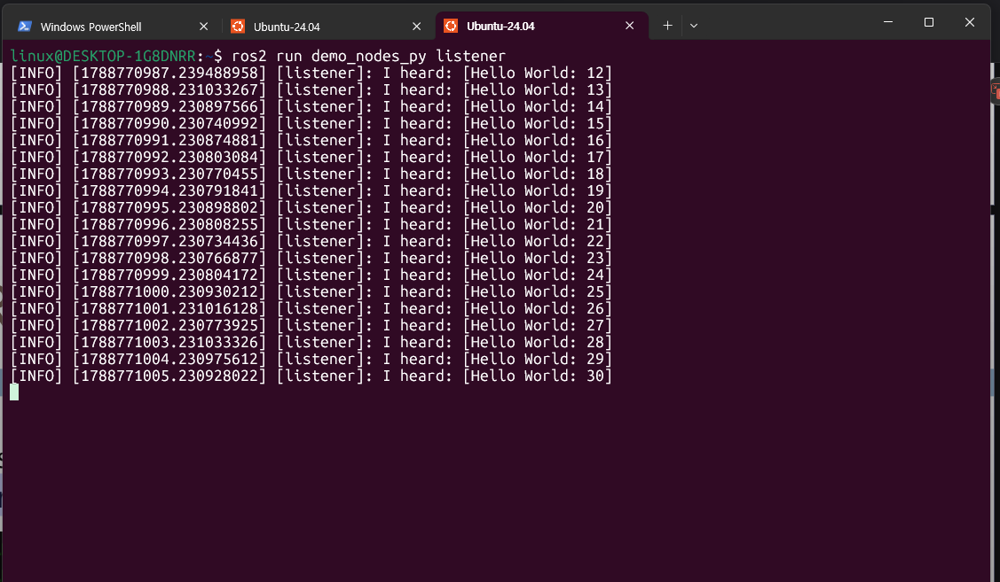
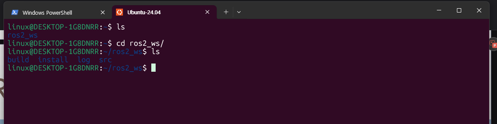

# Chapter 3. WSL2와 네트워크 명령어

## 1. WSL2의 기능

WSL2(Windows Subsystem for Linux 2)는 Windows 위에서 실제 리눅스 커널을 경량 가상머신(VM) 형태로 구동하는 기술이다. 주요 특징은 다음과 같다.

- **완전한 리눅스 커널 포함**: 실제 리눅스 커널을 사용하므로 시스템 콜 호환성이 WSL1보다 훨씬 높고, Docker 같은 컨테이너 기술도 정상 동작한다.
- **경량 유틸리티 VM 아키텍처**: 일반 VM과 달리 빠른 부팅, 적은 리소스 사용, Windows와의 파일 시스템 상호 접근을 지원한다.
- **독립된 가상 네트워크**: WSL2는 Hyper-V 기반 가상 스위치를 통해 자체 가상 네트워크 어댑터와 별도의 IP 대역을 가진다(그래서 Windows와 WSL의 IP가 다름).
- **Windows-Linux 상호운용**: `explorer.exe`, `code .` 등으로 Windows 프로그램을 리눅스 셸에서 실행하거나 반대로 접근 가능하다.

---

## 2. Windows에서 `ipconfig` 실행 결과



```
PS C:\WINDOWS\System32> ipconfig

Windows IP 구성

이더넷 어댑터 이더넷:
   연결별 DNS 접미사 . . . . :
   링크-로컬 IPv6 주소 . . . . : fe80::4e67:796b:2b5a:b69a%11
   IPv4 주소 . . . . . . . . . : 10.10.26.70
   서브넷 마스크 . . . . . . . : 255.255.255.0
   기본 게이트웨이 . . . . . . : 10.10.26.14

이더넷 어댑터 vEthernet (Default Switch):
   연결별 DNS 접미사 . . . . :
   링크-로컬 IPv6 주소 . . . . : fe80::eb91:f58b:f85d:197f%20
   IPv4 주소 . . . . . . . . . : 172.25.160.1
   서브넷 마스크 . . . . . . . : 255.255.240.0
   기본 게이트웨이 . . . . . . :

이더넷 어댑터 vEthernet (WSL (Hyper-V firewall)):
   연결별 DNS 접미사 . . . . :
   링크-로컬 IPv6 주소 . . . . : fe80::5a46:31ab:baf4:2a8d%33
   IPv4 주소 . . . . . . . . . : 172.26.240.1
   서브넷 마스크 . . . . . . . : 255.255.240.0
   기본 게이트웨이 . . . . . . :
```

캡처 결과에는 총 3개의 어댑터가 나타난다.

### 1) 이더넷 어댑터 이더넷 (실제 물리 네트워크)
- IPv4 주소: `10.10.26.70`, 서브넷 마스크 `255.255.255.0`, 기본 게이트웨이 `10.10.26.14`
- 이 PC가 실제로 연결된 학교/기관 네트워크(또는 공유기)의 IP다. 이 대역(`/24`)의 최대 호스트 수는 254개다.

### 2) vEthernet (Default Switch)
- IPv4 주소 `172.25.160.1`, 서브넷 마스크 `255.255.240.0`
- Hyper-V가 자동 생성하는 기본 가상 스위치용 어댑터다. 게이트웨이가 비어 있는 것으로 보아 이 어댑터는 외부 라우팅용이 아니라 Hyper-V 게스트(가상머신)와 통신하기 위한 내부 어댑터다.

### 3) vEthernet (WSL (Hyper-V firewall))
- IPv4 주소 `172.26.240.1`, 서브넷 마스크 `255.255.240.0`
- WSL2가 사용하는 가상 네트워크의 Windows 쪽 게이트웨이 인터페이스다. 리눅스 쪽 `ifconfig` 결과의 `172.26.246.109`(WSL 내부 IP)와 같은 `172.26.240.0/20` 대역에 속해 있어, Windows와 WSL 인스턴스가 이 가상 네트워크를 통해 서로 통신하는 구조임을 확인할 수 있다.

---

## 3. Linux(WSL2)에서 `ifconfig` 실행 결과



```
linux@DESKTOP-1G8DNRR:~$ ifconfig
eth0: flags=4163<UP,BROADCAST,RUNNING,MULTICAST>  mtu 1500
        inet 172.26.246.109  netmask 255.255.240.0  broadcast 172.26.255.255
        inet6 fe80::215:5dff:fedb:ebc5  prefixlen 64  scopeid 0x20<link>
        ether 00:15:5d:db:eb:c5  txqueuelen 1000  (Ethernet)
        RX packets 32  bytes 11463 (11.4 KB)
        RX errors 0  dropped 0  overruns 0  frame 0
        TX packets 54  bytes 7428 (7.4 KB)
        TX errors 0  dropped 0 overruns 0  carrier 0  collisions 0

lo: flags=73<UP,LOOPBACK,RUNNING>  mtu 65536
        inet 127.0.0.1  netmask 255.0.0.0
        inet6 ::1  prefixlen 128  scopeid 0x10<host>
        loop  txqueuelen 1000  (Local Loopback)
        RX packets 26  bytes 3611 (3.6 KB)
        RX errors 0  dropped 0  overruns 0  frame 0
        TX packets 26  bytes 3611 (3.6 KB)
        TX errors 0  dropped 0 overruns 0  carrier 0  collisions 0
```

### eth0 (WSL2 가상 네트워크 인터페이스)
- `flags=4163<UP,BROADCAST,RUNNING,MULTICAST>`: 인터페이스가 활성화(UP)되어 있고 브로드캐스트·멀티캐스트를 지원하며 정상 동작(RUNNING) 중임을 의미
- `mtu 1500`: 한 번에 전송 가능한 최대 프레임 크기(바이트)
- `inet 172.26.246.109 netmask 255.255.240.0 broadcast 172.26.255.255`: WSL2 리눅스 인스턴스에 할당된 IPv4 주소. Windows의 `vEthernet (WSL)` 게이트웨이(`172.26.240.1`)와 같은 대역(`/20`)에 속해 있어 이 게이트웨이를 통해 Windows 및 외부 네트워크와 통신한다.
- `inet6 fe80::215:5dff:fedb:ebc5`: 링크로컬 IPv6 주소로, 로컬 네트워크 세그먼트 내부에서만 유효
- `ether 00:15:5d:db:eb:c5`: 이 가상 어댑터의 MAC 주소 (`00:15:5d`는 Hyper-V 가상 어댑터 벤더 코드)
- RX/TX packets, bytes: 수신/송신한 패킷 수와 총 바이트 수. errors/dropped/overruns/collisions가 모두 0이므로 통신 오류 없이 정상 작동 중임을 의미

### lo (루프백 인터페이스)
- `flags=73<UP,LOOPBACK,RUNNING>`, `mtu 65536`
- `inet 127.0.0.1`: 자기 자신을 가리키는 루프백 주소로, 로컬 프로세스 간 통신(예: localhost 접속)에 사용
- `inet6 ::1`: IPv6의 루프백 주소
- RX/TX 값이 동일(26 packets, 3611 bytes)한 것은 루프백 특성상 자신이 보낸 패킷을 자신이 그대로 받기 때문

---

## 4. 정리 (WSL2/네트워크)

Windows 호스트와 WSL2 리눅스 인스턴스는 서로 다른 IP 대역을 가지지만, `vEthernet (WSL)` 가상 스위치를 통해 하나의 가상 네트워크로 연결되어 있는 구조다.

---

## 5. ROS2 패키지 설치 확인

WSL2 Ubuntu-24.04 환경의 `.bashrc`에 ROS2(Jazzy) 관련 설정이 등록되어 있는지 확인하여 설치 여부를 검증했다.



```bash
# ros2 init
source /opt/ros/jazzy/setup.bash
source ~/ros2_ws/install/local_setup.bash
source /usr/share/colcon_argcomplete/hook/colcon-argcomplete.bash
source /usr/share/vcstool-completion/vcs.bash
source /usr/share/colcon_cd/function/colcon_cd.sh
export LIBGL_ALWAYS_SOFTWARE=1
export _colcon_cd_root=~/ros2_ws
export ROS_DOMAIN_ID=3
export ROS_NAMESPACE=rapi5-3
export RMW_IMPLEMENTATION=rmw_fastrtps_cpp
export RCUTILS_COLORIZED_OUTPUT=1
export RCUTILS_LOGGING_USE_STDOUT=0
export RCUTILS_LOGGING_BUFFERED_STREAM=1
```

- `source /opt/ros/jazzy/setup.bash`: ROS2 Jazzy 배포판이 `/opt/ros/jazzy` 경로에 설치되어 있고, 셸 시작 시 자동으로 환경이 로드되도록 설정되어 있음을 확인할 수 있다.
- `source ~/ros2_ws/install/local_setup.bash`: 사용자가 만든 워크스페이스(`ros2_ws`)가 이미 빌드되어 `install` 폴더가 존재하며, 해당 워크스페이스의 패키지들도 자동으로 환경에 포함됨을 의미한다.
- `ROS_DOMAIN_ID=3`, `RMW_IMPLEMENTATION=rmw_fastrtps_cpp` 등: DDS 통신 도메인과 미들웨어 구현체가 지정되어 있어, 같은 도메인 ID를 쓰는 다른 ROS2 노드와 통신 가능한 상태임을 알 수 있다.

또한 `ros2 --help` 명령을 실행하여 `ros2` CLI가 정상적으로 인식되는지 확인했다.



```
linux@DESKTOP-1G8DNRR:~$ ros2 --help
usage: ros2 [-h] [--use-python-default-buffering] Call `ros2 <command> -h` for more detailed usage. ...

ros2 is an extensible command-line tool for ROS 2.

Commands:
  action, bag, component, daemon, doctor, interface, launch,
  lifecycle, multicast, node, param, pkg, plugin, run, security,
  service, topic, wtf
```

`ros2` 명령어가 오류 없이 실행되고 `action`, `topic`, `node`, `run` 등 서브커맨드 목록이 정상 출력되므로 ROS2 CLI 도구가 올바르게 설치되어 있음을 확인했다.

추가로 `colcon` 빌드 도구의 설치 여부도 확인했다.



```
colcon verbs:
  build           Build a set of packages
  extension-points  List extension points
  extensions      List extensions
  graph           Generate a visual representation of the dependency graph
  info            Package information
  list            List packages, optionally in topological ordering
  ...
```

`colcon` 명령어의 `build`, `list`, `graph` 등 서브커맨드가 정상적으로 출력되어, ROS2 워크스페이스 빌드에 필요한 `colcon` 빌드 시스템도 함께 설치되어 있음을 확인했다.

---

## 6. ROS2 패키지 예제 테스트 (talker / listener)

ROS2에서 기본으로 제공하는 데모 패키지(`demo_nodes_cpp`, `demo_nodes_py`)를 이용해 퍼블리셔-구독자(Publisher-Subscriber) 통신 예제를 테스트했다.

**Publisher (talker) 실행 — C++ 노드**



```
linux@DESKTOP-1G8DNRR:~$ ros2 run demo_nodes_cpp talker
[INFO] [1788770976.230923296] [talker]: Publishing: 'Hello World: 1'
[INFO] [1788770977.230346133] [talker]: Publishing: 'Hello World: 2'
...
[INFO] [1788770990.230197982] [talker]: Publishing: 'Hello World: 15'
```

`demo_nodes_cpp` 패키지의 `talker` 노드를 실행하면 1초 간격으로 `Hello World: N`이라는 문자열 메시지를 토픽에 계속 퍼블리시(publish)한다. 각 로그 앞의 숫자는 유닉스 타임스탬프이며, 노드 이름 `[talker]`와 함께 정상적으로 메시지가 송신되고 있음을 보여준다.

**Subscriber (listener) 실행 — Python 노드**



```
linux@DESKTOP-1G8DNRR:~$ ros2 run demo_nodes_py listener
[INFO] [1788770987.239488958] [listener]: I heard: [Hello World: 12]
[INFO] [1788770988.231033267] [listener]: I heard: [Hello World: 13]
...
[INFO] [1788771005.230928022] [listener]: I heard: [Hello World: 30]
```

다른 터미널 탭에서 `demo_nodes_py` 패키지의 `listener` 노드를 실행하면, `talker`가 퍼블리시한 동일 토픽(`chatter`)의 메시지를 구독(subscribe)하여 `I heard: [...]` 형태로 출력한다. `listener`가 12번째 메시지부터 수신을 시작한 것은, `talker`가 먼저 실행되어 이미 몇 개의 메시지를 퍼블리시한 뒤에 `listener`를 늦게 실행했기 때문이다.

이 테스트를 통해 서로 다른 언어(C++/Python)로 작성된 노드 간에도 ROS2의 DDS 기반 통신이 정상적으로 이루어짐을 확인했다.

---

## 7. ROS2 워크스페이스 빌드 테스트

`ros2_ws` 워크스페이스 디렉터리 구조를 확인하여 `colcon build`가 정상적으로 수행되었는지 검증했다.



```
linux@DESKTOP-1G8DNRR:~$ ls
ros2_ws
linux@DESKTOP-1G8DNRR:~$ cd ros2_ws/
linux@DESKTOP-1G8DNRR:~/ros2_ws$ ls
build  install  log  src
```

`colcon build` 명령을 실행하면 워크스페이스 최상위에 다음 4개의 폴더가 생성된다.

- **src**: 실제 ROS2 패키지 소스 코드가 위치하는 폴더
- **build**: 소스 코드를 컴파일하는 과정에서 생성되는 중간 산출물(오브젝트 파일, CMake 캐시 등)이 저장되는 폴더
- **install**: 빌드가 완료된 후 실행 가능한 형태로 설치된 실행 파일, 라이브러리, `setup.bash` 등이 위치하는 폴더로, 이 폴더의 `local_setup.bash`를 `source`하면 해당 워크스페이스의 패키지를 사용할 수 있다.
- **log**: 빌드 과정에서 발생한 로그 파일들이 기록되는 폴더

네 개의 폴더(`build`, `install`, `log`, `src`)가 모두 정상적으로 존재하는 것으로 보아, 해당 워크스페이스에서 `colcon build` 빌드가 오류 없이 완료되었음을 확인할 수 있다.

---

## 8. 정리 (ROS2)

- `.bashrc`의 ROS2 환경 변수 설정과 `ros2 --help`, `colcon --help` 정상 출력을 통해 ROS2 Jazzy 및 colcon 빌드 도구가 정상적으로 설치되어 있음을 확인했다.
- `demo_nodes_cpp`의 `talker`와 `demo_nodes_py`의 `listener`를 각각 실행하여, 서로 다른 언어로 작성된 노드 간 토픽 기반 퍼블리셔-구독자 통신이 정상 동작함을 확인했다.
- `ros2_ws` 워크스페이스 내부에 `build`, `install`, `log`, `src` 폴더가 모두 생성되어 있음을 통해 `colcon build`가 정상적으로 완료되었음을 확인했다.
