# Chapter 9, 10. ROS2 패키지와 노드 — 실습과제

## 1. 패키지, 노드, 메시지, 메시지통신, 토픽, 서비스, 액션, 파라미터 구분

- **패키지(Package)**: 하나 이상의 노드 또는 노드 실행을 위한 정보 등을 묶어 놓은 단위
- **노드(Node)**: 최소 단위의 실행 가능한 프로세스. ROS는 재사용성을 높이기 위해 노드 단위로 기능을 나누어 프로그램을 작성함
- **메시지(Message)**: 노드와 노드 사이에 주고받는 데이터. integer, float, boolean, string 같은 변수나 이들을 조합한 데이터 구조
- **메시지 통신(Message Communication)**: 노드 간에 메시지를 주고받는 방식 자체를 가리키는 말이며, 아래의 토픽/서비스/액션/파라미터로 세분화됨
- **토픽(Topic)**: 비동기식 **단방향** 통신. 발행자(Publisher)가 데이터를 발간하면 구독자(Subscriber)가 받는 방식으로, 1:N, N:1, N:N 통신이 모두 가능한 가장 널리 쓰이는 방식
- **서비스(Service)**: 동기식 **양방향** 통신. 요청(Request)하는 Service client와 요청을 처리해 응답(Response)하는 Service server 간의 통신
- **액션(Action)**: 비동기식+동기식이 섞인 양방향 통신. 목표(Goal)를 보내는 Action client와, 중간 진행 상황(Feedback) 및 최종 결과(Result)를 돌려주는 Action server 간의 통신으로, 토픽과 서비스를 혼합한 형태
- **파라미터(Parameter)**: 노드 내부 또는 전역 매개변수를 서비스 통신 방식으로 Get/Set 할 수 있게 해주는 기능. 동작 방식은 서비스와 동일

---

## 2. turtlesim 명령어 실습

`turtlesim` 패키지를 이용해 강의노트에 나온 명령어를 순서대로 실습한 결과다.

### 2-1. 설치된 패키지 목록 확인 (`ros2 pkg list`)

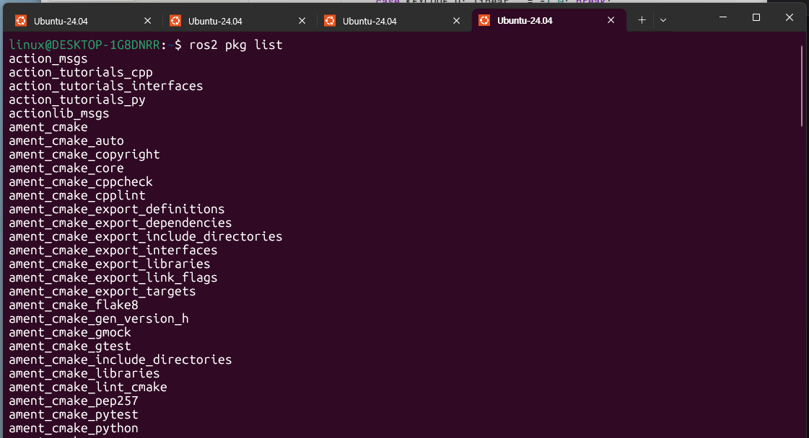

시스템에 설치된 모든 ROS2 패키지 목록이 출력된다. `action_msgs`, `ament_cmake` 계열 등 다양한 패키지가 확인된다.

### 2-2. turtlesim 패키지의 실행파일 목록 확인 (`ros2 pkg executables turtlesim`)

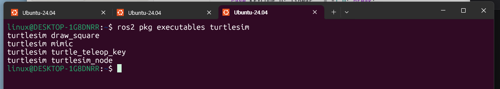

`turtlesim` 패키지에 포함된 4개의 노드(`draw_square`, `mimic`, `turtle_teleop_key`, `turtlesim_node`)가 출력된다.

### 2-3. turtlesim_node 실행 (`ros2 run turtlesim turtlesim_node`)

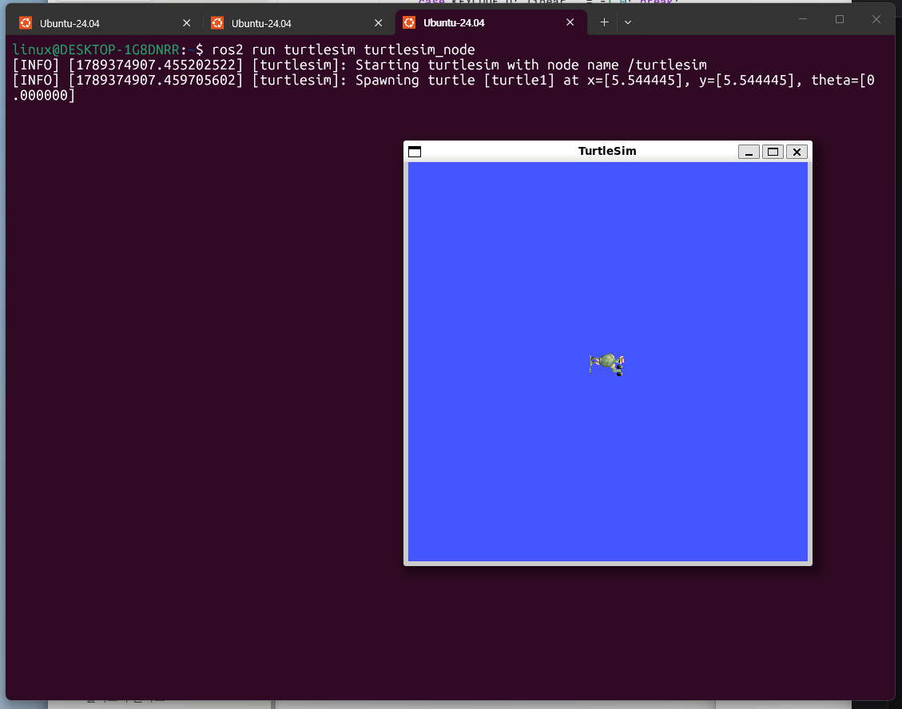

`/turtlesim` 노드 이름으로 실행되며, 파란 배경의 TurtleSim 창에 거북이 한 마리가 스폰된다.

### 2-4. turtle_teleop_key 실행 (`ros2 run turtlesim turtle_teleop_key`)

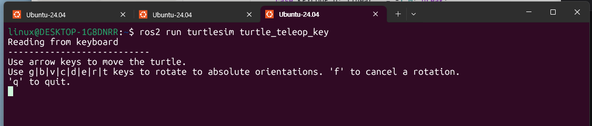

키보드 입력을 받는 노드가 실행되며, 화살표키로 이동하고 `g`,`b`,`v`,`c`,`d`,`e`,`r`,`t` 키로 절대 방향 회전이 가능하다는 안내 문구가 출력된다.

### 2-5. 실행 중인 노드 목록 확인 (`ros2 node list`)

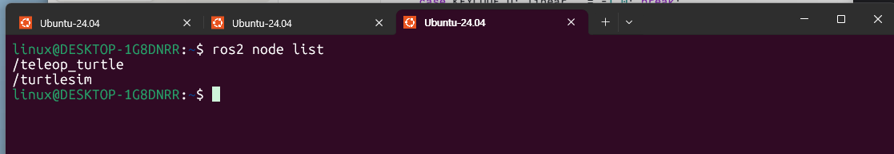

`turtlesim_node`는 `/turtlesim`, `turtle_teleop_key`는 `/teleop_turtle`이라는 노드 이름으로 각각 실행 중임을 확인할 수 있다. (실행파일명과 노드명이 다름)

### 2-6. 토픽 목록 확인 (`ros2 topic list`)

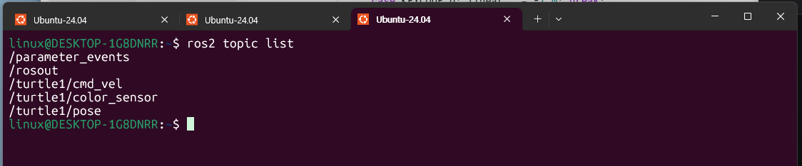

`/turtle1/cmd_vel`, `/turtle1/pose`, `/turtle1/color_sensor` 등 turtle1과 관련된 토픽들이 확인된다.

### 2-7. 서비스 목록 확인 (`ros2 service list`)

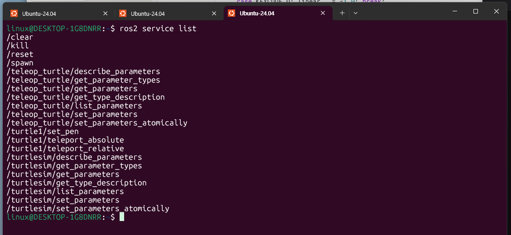

`/spawn`, `/reset`, `/clear`, `/turtle1/set_pen`, `/turtle1/teleport_absolute` 등 다양한 서비스가 확인된다.

### 2-8. 액션 목록 확인 (`ros2 action list`)

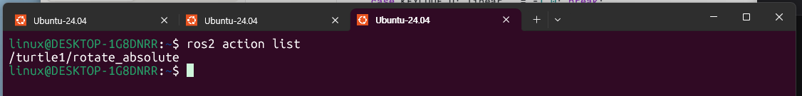

`/turtle1/rotate_absolute` 액션이 확인된다.

### 2-9. rqt_graph로 노드-토픽 그래프 확인 (`ros2 run rqt_graph rqt_graph`)

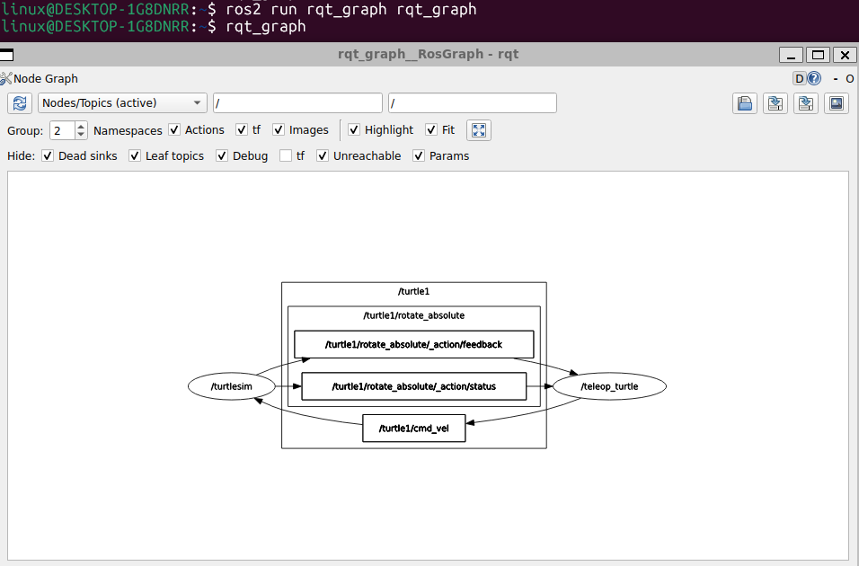

`/turtlesim`, `/teleop_turtle` 두 노드가 `/turtle1/cmd_vel` 토픽과 `/turtle1/rotate_absolute` 액션(피드백/상태)으로 연결된 그래프를 확인할 수 있다.

### 2-10. 노드 상세 정보 확인 (`ros2 node info /turtlesim`)

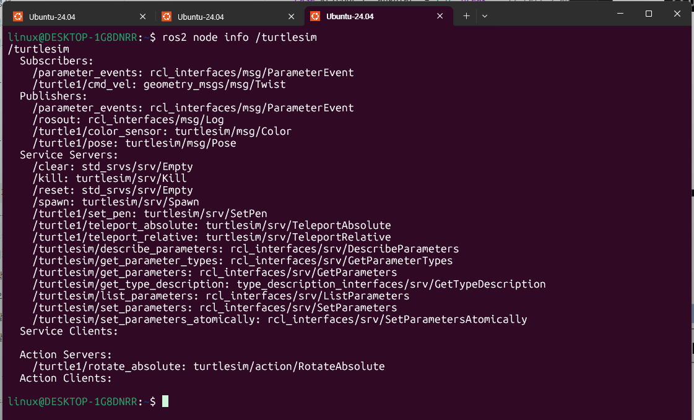

`/turtlesim` 노드의 Subscribers, Publishers, Service Servers, Action Servers 정보가 모두 출력된다. `/turtle1/cmd_vel`을 구독하고, `/turtle1/pose`·`/turtle1/color_sensor`를 발행하며, `/spawn`·`/set_pen`·`/teleport_absolute` 등의 서비스 서버와 `/turtle1/rotate_absolute` 액션 서버를 가지고 있음을 알 수 있다.

---

## 3. 거북이 8자(∞) 그리기 결과

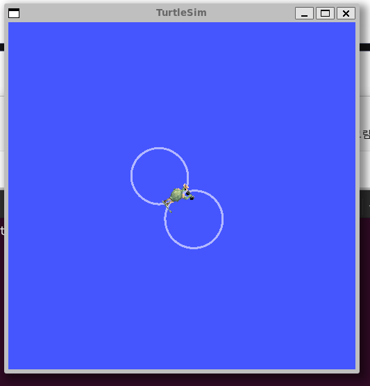

거북이가 한 원을 그린 뒤, 반대 방향으로 도는 두 번째 원을 이어서 그려 8자(∞) 모양의 궤적을 완성했다.
