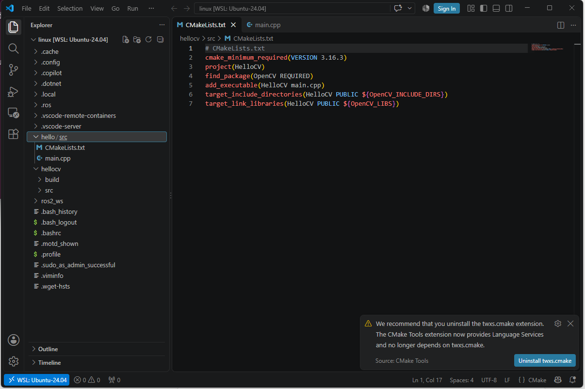
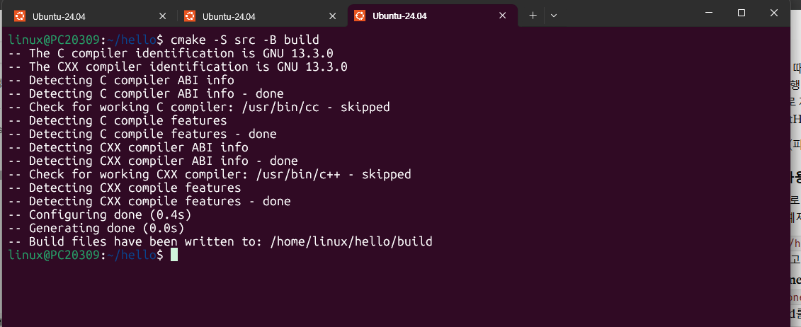
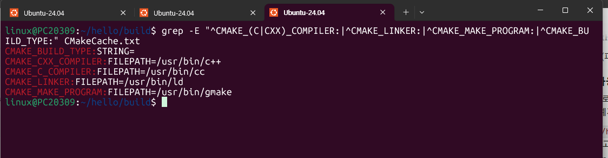
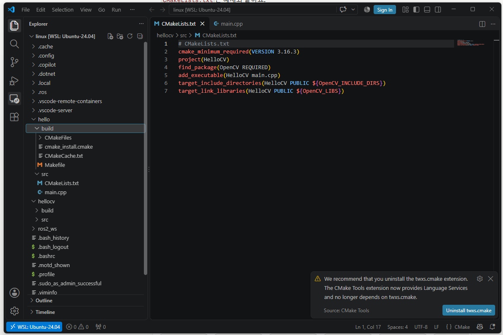
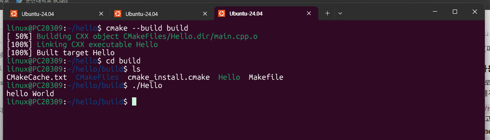
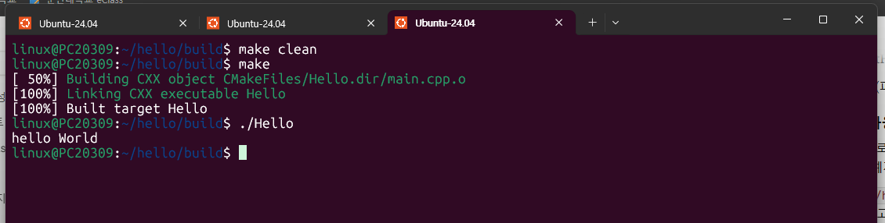
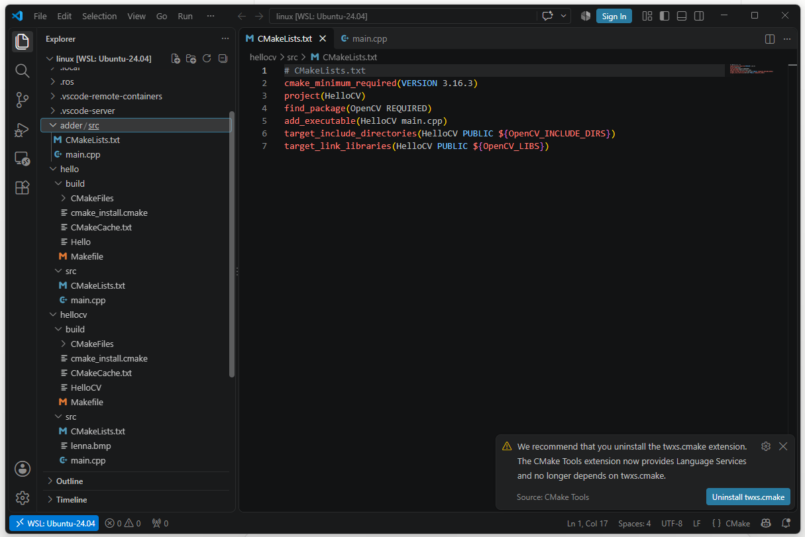
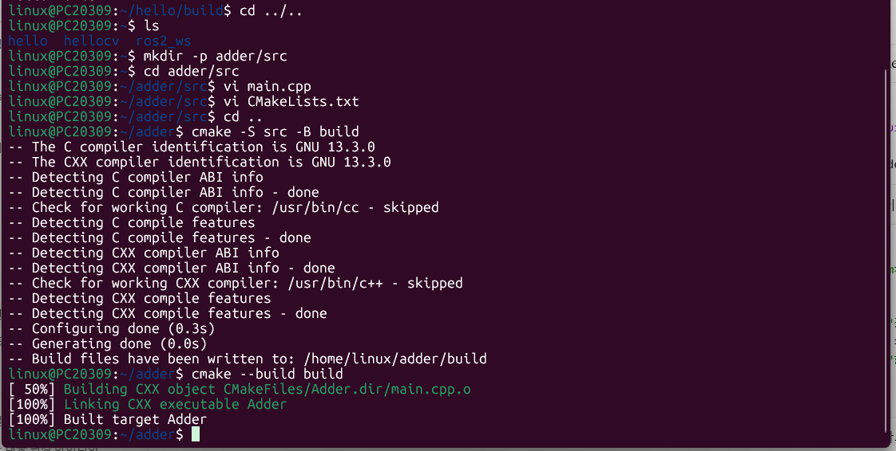
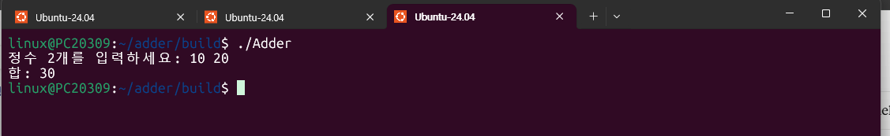

# 12장. CMake 사용법 2 — 실습과제

## 실습과제 1 — CMake 개념과 단계별 결과물 (예제 1: Hello world 사용)

예제 1의 `hello` 프로젝트(화면에 Hello World를 출력하는 C++ 프로그램)를 실제로 빌드하면서 아래 5개 질문에 답한다.

### 0. 실습 환경 구성



`hello/src/` 안에 `CMakeLists.txt`와 `main.cpp` 두 파일을 작성했다. `build` 폴더는 만들어 두지 않고 `cmake` 명령이 자동으로 생성한다.

```
$ cmake -S src -B build
```



- 컴파일러 식별(GNU 13.3.0), ABI·컴파일 기능 점검 등 시스템 정보를 자동으로 수집했다.
- 이 프로젝트는 외부 라이브러리를 쓰지 않으므로 `find_package` 관련 `Found ...` 줄은 나오지 않는다.
- `Configuring done`, `Generating done`, `Build files have been written to: /home/linux/hello/build`로 Configure와 Generate가 모두 끝났다.

---

### 1. CMake와 GNU Make의 차이점을 설명하라.

GNU Make는 **빌드 도구**이고, CMake는 그 빌드 도구가 쓸 파일을 만들어 주는 **빌드 파일 생성기**이다. CMake 자체는 컴파일러도 아니고 직접 컴파일을 하지도 않으며, 프로젝트 빌드 전 과정을 지휘하는 역할을 한다.

| 구분 | GNU Make | CMake |
|---|---|---|
| 정체 | 빌드 도구 (Makefile을 읽어 컴파일, 링크 수행) | 빌드 파일 생성기 (빌드 도구용 파일을 자동 생성) |
| 설정 파일 | `Makefile`을 직접 작성 (컴파일러, 옵션, 의존 관계를 모두 직접 명시) | `CMakeLists.txt`에 프로젝트 정보만 간단히 작성 |
| 플랫폼 | 주로 Linux/Unix 환경 | Windows, Linux, macOS 등 다양한 플랫폼 지원 |
| 생성하는 결과 | 실행파일 | GNU Make/Ninja용 Makefile, Visual Studio용 solution 파일, Xcode용 project 파일 |
| 라이브러리 | 경로를 직접 지정 | `find_package`로 시스템에서 자동 검색 |
| 작성 난이도 | 규칙이 길어지면 복잡해짐 | Makefile보다 작성이 매우 쉬움 |

즉 Make만 쓰면 운영체제마다 다른 빌드 도구에 맞춰 각각 설정 파일을 작성해야 하지만, CMake를 쓰면 하나의 `CMakeLists.txt`로 환경에 맞는 빌드 파일을 자동으로 만들 수 있다. 이번 실습에서도 CMake가 Linux 환경에 맞는 `Makefile`을 생성했고, 실제 빌드는 `make`가 수행했다.

### 2. CMakeLists.txt의 역할을 설명하라.

- CMake 언어로 작성하는 **프로젝트 설정 파일**(텍스트 파일)로, C/C++ 프로젝트를 빌드하기 위한 정보를 기술한다.
- 프로젝트 이름, 최소 CMake 버전, 소스 파일, 만들 실행파일(타깃), 사용할 라이브러리, 헤더 경로 등을 설정한다.
- `cmake` 명령을 실행할 때 **소스 트리(-S)에 반드시 존재**해야 하며, Configure 단계에서 이 파일을 해석하고 실행한다.
- GNU Make의 `Makefile`과 같은 역할이지만 훨씬 쉽게 작성할 수 있다.
- 이번 `hello` 프로젝트에서는 `cmake_minimum_required`(최소 버전), `project`(프로젝트명), `add_executable`(실행파일 `Hello`를 `main.cpp`로 생성) 3개 명령이 이 역할을 했다.

### 3. CMakeCache.txt의 역할을 설명하라.

- `cmake` 명령 실행 시 **자동으로 생성**되는 파일이며, 빌드 트리(`build/`)에 저장된다.
- Configure 단계에서 수집한 정보(시스템 정보, 컴파일러·링커·make의 경로, 라이브러리 경로 등)를 `KEY:TYPE=VALUE` 형식의 환경변수로 저장한다.
- 이후 빌드 단계에서 이 변수에 저장된 경로와 라이브러리 정보를 이용해 컴파일과 링크를 수행한다.
- 한 번 저장된 값은 재사용하므로 다시 `cmake`를 실행할 때 같은 검색을 반복하지 않는다.

`CMakeCache.txt`에서 빌드 도구 관련 항목만 추려 본 결과는 다음과 같다.

```
$ grep -E "^CMAKE_(C|CXX)_COMPILER:|^CMAKE_LINKER:|^CMAKE_MAKE_PROGRAM:|^CMAKE_BUILD_TYPE:" CMakeCache.txt
```



| 변수 | 값 | 의미 |
|---|---|---|
| `CMAKE_C_COMPILER` | `/usr/bin/cc` | C 컴파일러 경로 |
| `CMAKE_CXX_COMPILER` | `/usr/bin/c++` | C++ 컴파일러 경로 |
| `CMAKE_LINKER` | `/usr/bin/ld` | 링커 경로 |
| `CMAKE_MAKE_PROGRAM` | `/usr/bin/gmake` | 빌드에 사용할 make 프로그램 경로 (GNU Make) |
| `CMAKE_BUILD_TYPE` | (비어 있음) | 빌드 종류(Debug, Release 등)를 지정하지 않은 상태 |

변수의 값은 `CMakeLists.txt`에 적은 것이 아니라 CMake가 시스템에서 자동으로 찾아 기록한 것이다. (`CMAKE_MAKE_PROGRAM`이 `make`가 아닌 `gmake`로 잡힌 것은 시스템마다 GNU Make를 가리키는 이름이 다를 수 있기 때문이다.)

### 4. CMake의 각 단계별(configure → generate → build) 결과물을 자세히 설명하라.

CMake는 **Configure → Generate → Build** 3단계로 프로젝트를 빌드한다.

| 단계 | 명령 | 하는 일 | 결과물 |
|---|---|---|---|
| Configure | `cmake -S src -B build` | `CMakeLists.txt`를 해석, 실행하고 시스템, 컴파일러, 라이브러리 정보를 자동으로 검색 | `CMakeCache.txt`(환경변수 저장), `CMakeFiles/`(컴파일러 확인 결과, 로그 등) |
| Generate | (위 명령에 이어서 수행) | Configure 결과를 바탕으로 사용 중인 빌드 도구에 맞는 파일 생성 | `Makefile`, `cmake_install.cmake`, `CMakeFiles/Hello.dir/`(타깃 `Hello` 빌드 정보) |
| Build | `cmake --build build` | 생성된 `Makefile`로 빌드 도구를 호출해 컴파일, 링크 수행 | 오브젝트 파일 `main.cpp.o`, 최종 실행파일 `Hello` |

**Configure + Generate 결과** (`cmake -S src -B build` 직후의 `build` 폴더)



- `CMakeCache.txt`: Configure 단계의 결과로, 수집한 환경 정보가 저장된 파일이다.
- `Makefile`: Generate 단계의 결과로, 이후 빌드에 사용되는 파일이다. 개발자가 직접 작성하지 않고 CMake가 만들어 준다.
- `CMakeFiles/`: 컴파일러 식별 결과, 타깃별 빌드 정보(`Hello.dir`) 등 CMake가 내부적으로 사용하는 파일이 들어 있다.
- `cmake_install.cmake`: `install` 명령 사용 시 설치 규칙을 담는 스크립트이다.
- 이 시점까지는 **실행파일이 아직 없다.**

**Build 결과**

```
$ cmake --build build
$ cd build
$ ls
$ ./Hello
```



- `[ 50%] Building CXX object CMakeFiles/Hello.dir/main.cpp.o`: 소스 `main.cpp`를 컴파일해 오브젝트 파일을 생성한다.
- `[100%] Linking CXX executable Hello`: 오브젝트 파일을 링크해 실행파일 `Hello`를 생성한다.
- `ls` 결과에 실행파일 `Hello`가 새로 나타나, 최종 결과물이 `build` 폴더에 생긴 것을 확인할 수 있다.
- `./Hello`를 실행하면 `hello World`가 출력된다.

정리하면 Configure는 **정보 수집(CMakeCache.txt)**, Generate는 **빌드 파일 생성(Makefile)**, Build는 **실행파일 생성(Hello)** 단계이다.

### 5. 예제 1에서 `cmake --build build` 대신 `make` 명령어를 이용하여 빌드해 보시오.

Generate 단계 후 `build` 폴더에 `Makefile`이 생성되므로, `build` 폴더로 이동해 `make`를 직접 실행해도 빌드할 수 있다. 앞에서 이미 빌드해 둔 상태라 그대로 `make`를 하면 컴파일 없이 끝나기 때문에, 먼저 `make clean`으로 결과물을 지운 뒤 `make`를 실행했다.

```
$ cd hello/build
$ make clean
$ make
$ ./Hello
```



- `make clean`: 이전 빌드 결과물(오브젝트 파일, 실행파일)을 삭제한다.
- `make`: `Building CXX object ... main.cpp.o` → `Linking CXX executable Hello` → `Built target Hello` 순서로 컴파일과 링크를 수행했다.
- `./Hello`: `hello World`가 출력되어 `cmake --build build`로 빌드했을 때와 **같은 결과**가 나왔다.
- 빌드 로그도 4번의 `cmake --build build` 결과와 같다. `cmake --build`가 내부적으로 Generate 단계에서 만들어진 `Makefile`을 이용해 빌드 도구(GNU Make)를 호출하기 때문이다. `cmake --build`는 Make, Visual Studio, Xcode 등 어떤 빌드 도구든 같은 명령으로 호출할 수 있다는 장점이 있고, `make`는 Makefile 환경에서 직접 실행하는 방식이다.

---

## 실습과제 2 — 2개의 정수를 입력받아 합을 출력하는 C++ 프로그램 (`adder`)

CMake로 2개의 정수를 입력받아 합을 출력하는 프로그램을 작성했다. 프로젝트 이름은 `adder`이고, 구조는 `hello`와 같이 `src`(CMakeLists.txt, main.cpp)와 자동 생성되는 `build`로 구성했다.

### 1. 프로젝트 구조



- `adder/src/` 안에 `CMakeLists.txt`와 `main.cpp`를 작성했다.
- `CMakeLists.txt`에서는 `hello`와 같은 방식으로 `cmake_minimum_required`, `project`, `add_executable` 명령을 사용해 `main.cpp`로부터 실행파일 `Adder`를 만든다. OpenCV 같은 외부 라이브러리가 필요 없어 `find_package`는 사용하지 않았다.

### 2. Configure, Generate & Build

```
$ mkdir -p adder/src
$ cd adder/src
$ vi main.cpp          # 소스 작성
$ vi CMakeLists.txt    # CMake 설정 파일 작성
$ cd ..
$ cmake -S src -B build
$ cmake --build build
```



- 디렉토리 생성, `vi`로 두 파일 작성, `cmake` 실행 위치(`adder`)로 이동하는 과정을 거쳤다.
- `cmake -S src -B build`: 컴파일러 확인(GNU 13.3.0) 후 `Configuring done`, `Generating done`, `Build files have been written to: /home/linux/adder/build`로 Configure, Generate가 끝났다. OpenCV를 쓰지 않으므로 `Found OpenCV` 줄은 없다.
- `cmake --build build`: `Building CXX object CMakeFiles/Adder.dir/main.cpp.o`로 소스를 컴파일하고, `Linking CXX executable Adder`로 링크해 실행파일 `Adder`를 만들었다. 마지막 `Built target Adder`로 빌드가 완료되었다.

### 3. 실행 결과

```
$ cd build
$ ./Adder
```



- 프로그램이 `정수 2개를 입력하세요:` 안내 문구를 출력하면 `10 20`을 입력했다.
- 입력한 두 정수의 합인 `합: 30`이 출력되어 정상적으로 동작함을 확인했다.
- 실행파일은 `build` 폴더에 만들어지므로 `build`로 이동해 `./Adder`로 실행한다.
